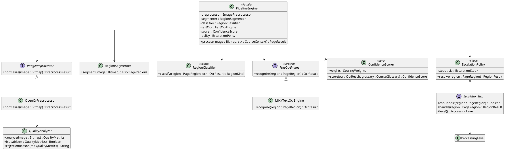
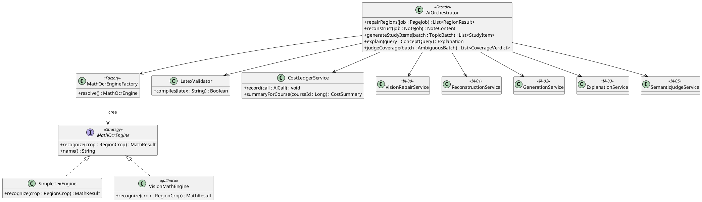
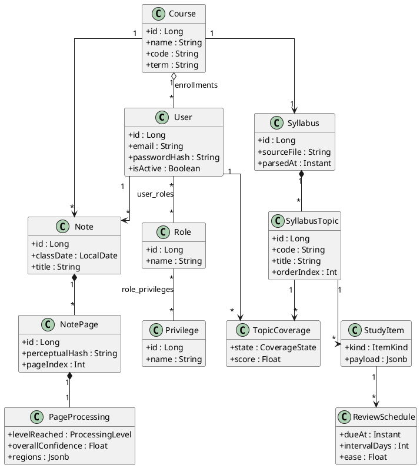
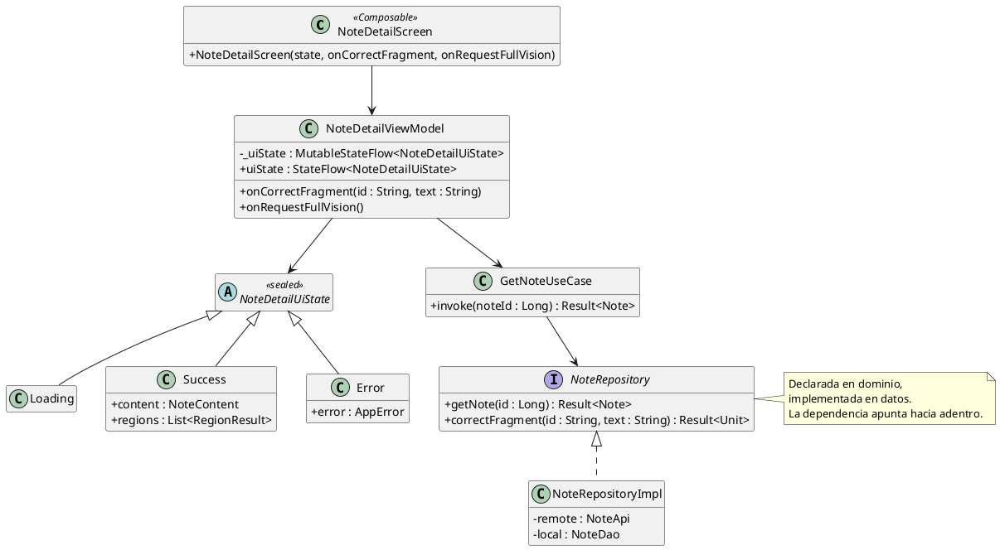

# Glifo — Arquitectura y Estándares

**Grupo X-Ray** — Brandon Brenes · David González · Felipe Ugalde
Documento técnico de referencia · versión 1.0

> Define **cómo se construye** Glifo: capas, estructura de paquetes, clases, patrones, convenciones de código y estándares de trabajo.
>
> · `Glifo_Alcance.md` — qué se construye
> · `Glifo_Diseno_Arquitectura.md` — versión para consulta con el docente
> · `Glifo_Bitacora_Decisiones.md` — histórico de decisiones

---

## Índice

1. [Visión general de la arquitectura](#1-visión-general-de-la-arquitectura)
2. [Estructura de paquetes — Android](#2-estructura-de-paquetes--android)
3. [Estructura de paquetes — Backend](#3-estructura-de-paquetes--backend)
4. [Diagramas de clases](#4-diagramas-de-clases)
5. [Patrones de diseño aplicados](#5-patrones-de-diseño-aplicados)
6. [Modelo de datos](#6-modelo-de-datos)
7. [Convenciones de código](#7-convenciones-de-código)
8. [Convenciones REST](#8-convenciones-rest)
9. [Manejo de errores](#9-manejo-de-errores)
10. [Estándares de pruebas](#10-estándares-de-pruebas)
11. [Flujo de trabajo con Git](#11-flujo-de-trabajo-con-git)
12. [Identidad visual y tokens de diseño](#12-identidad-visual-y-tokens-de-diseño)

---

## 1. Visión general de la arquitectura

### 1.1 Topología

```
┌──────────────────────────────────────────────────────────┐
│  CLIENTE ANDROID                                          │
│  Kotlin · Jetpack Compose · MVVM · Hilt                   │
│                                                            │
│  ┌────────────────────────────────────────────────────┐  │
│  │ PRESENTACIÓN   Composables · ViewModels · UiState  │  │
│  ├────────────────────────────────────────────────────┤  │
│  │ DOMINIO        Modelos · UseCases · Interfaces     │  │
│  ├────────────────────────────────────────────────────┤  │
│  │ DATOS          Repositorios · Room · Retrofit      │  │
│  ├────────────────────────────────────────────────────┤  │
│  │ PIPELINE       OpenCV · ML Kit · Confianza         │  │
│  └────────────────────────────────────────────────────┘  │
└───────────────────────────┬──────────────────────────────┘
                            │ HTTPS · JSON · JWT
┌───────────────────────────▼──────────────────────────────┐
│  BACKEND — Spring Boot monolítico                         │
│                                                            │
│  ┌────────────────────────────────────────────────────┐  │
│  │ WEB            Controllers · DTOs · Validación     │  │
│  ├────────────────────────────────────────────────────┤  │
│  │ SERVICIO       Lógica de negocio · Orquestación IA │  │
│  ├────────────────────────────────────────────────────┤  │
│  │ PERSISTENCIA   Repositories · Entities · JPA       │  │
│  └────────────────────────────────────────────────────┘  │
│                                                            │
│  PostgreSQL (relacional + JSONB)                          │
└──────────────────────────────────────────────────────────┘
```

### 1.2 Reglas de dependencia

La dirección de las dependencias es **siempre hacia adentro**:

```
Presentación → Dominio ← Datos
```

- **Dominio no depende de nada.** No conoce Android, Room, Retrofit ni Spring. Es Kotlin puro.
- **Datos implementa interfaces del dominio.** El dominio declara `NoteRepository`; la capa de datos provee `NoteRepositoryImpl`.
- **Presentación consume el dominio**, nunca la capa de datos directamente.

**Consecuencia práctica:** el `ConfidenceScorer` y el `EscalationPolicy` viven en el dominio, no dependen del framework, y por eso son testeables sin emulador.

### 1.3 Qué corre dónde

| Responsabilidad | Cliente | Backend | Motivo |
|---|---|---|---|
| Preprocesamiento de imagen (N0) | ✓ | | Reduce datos antes de transmitir |
| OCR de texto (N1) | ✓ | | ML Kit es local y gratuito |
| Clasificación de regiones | ✓ | | Depende del resultado de N1 |
| Cálculo de confianza | ✓ | | Función pura, sin dependencias |
| OCR matemático (N1.5) | | ✓ | Requiere credencial de servicio |
| Reparación por visión (N2, N3) | | ✓ | Requiere credencial de servicio |
| Validación de LaTeX | | ✓ | JLaTeXMath es una biblioteca Java |
| Prefiltro de cobertura | ✓ | | Determinista, funciona sin conexión |
| Adjudicación semántica | | ✓ | Requiere credencial de servicio |
| Repetición espaciada | ✓ | | Determinista, funciona sin conexión |
| Registro de consumo | | ✓ | Fuente única de verdad |

**Regla absoluta:** ninguna credencial de servicio externo existe en el APK.

---

## 2. Estructura de paquetes — Android

Paquete raíz: `cr.ac.una.glifo`

```
cr.ac.una.glifo/
│
├── GlifoApplication.kt              @HiltAndroidApp
├── MainActivity.kt
│
├── di/                              Módulos de Hilt
│   ├── NetworkModule.kt
│   ├── DatabaseModule.kt
│   ├── PipelineModule.kt
│   └── RepositoryModule.kt
│
├── core/                            Transversal, sin lógica de negocio
│   ├── common/
│   │   ├── Result.kt                Envoltorio de resultado
│   │   ├── AppError.kt              Jerarquía de errores de dominio
│   │   └── Constants.kt
│   ├── network/
│   │   ├── ApiClient.kt
│   │   ├── AuthInterceptor.kt       Inyecta el JWT
│   │   └── ErrorMapper.kt           HTTP → AppError
│   ├── database/
│   │   ├── GlifoDatabase.kt
│   │   ├── Converters.kt            JSON ↔ objeto
│   │   └── dao/
│   ├── sync/
│   │   ├── SyncQueue.kt
│   │   ├── SyncWorker.kt            WorkManager
│   │   └── RetryPolicy.kt           Backoff exponencial
│   └── ui/
│       ├── theme/                   Color · Type · Shape
│       └── component/               Componentes reutilizables
│
├── pipeline/                        ◄── EL DIFERENCIADOR
│   ├── PipelineEngine.kt            Fachada
│   ├── model/
│   │   ├── PageRegion.kt
│   │   ├── RegionKind.kt            TEXT · MATH · DRAWING
│   │   ├── ProcessingLevel.kt       N0 · N1 · N1_5 · N2 · N3
│   │   ├── QualityMetrics.kt
│   │   └── ConfidenceScore.kt
│   ├── preprocess/
│   │   ├── ImagePreprocessor.kt     Interfaz
│   │   ├── OpenCvPreprocessor.kt
│   │   └── QualityAnalyzer.kt       Desenfoque · luz · reflejo
│   ├── segment/
│   │   ├── RegionSegmenter.kt
│   │   └── RegionClassifier.kt      Enrutador
│   ├── ocr/
│   │   ├── TextOcrEngine.kt         Interfaz
│   │   └── MlKitTextOcrEngine.kt
│   ├── confidence/
│   │   ├── ConfidenceScorer.kt      Función pura
│   │   └── ScoringWeights.kt
│   ├── escalation/
│   │   ├── EscalationPolicy.kt
│   │   └── EscalationStep.kt        Chain of Responsibility
│   └── hash/
│       └── PerceptualHasher.kt
│
└── feature/                         Un paquete por funcionalidad
    ├── auth/
    │   ├── data/
    │   │   ├── remote/  AuthApi.kt · dto/
    │   │   ├── local/   TokenStore.kt
    │   │   └── AuthRepositoryImpl.kt
    │   ├── domain/
    │   │   ├── model/       User.kt · Role.kt
    │   │   ├── AuthRepository.kt        Interfaz
    │   │   └── usecase/     LoginUseCase.kt
    │   └── presentation/
    │       ├── LoginScreen.kt
    │       ├── LoginViewModel.kt
    │       └── LoginUiState.kt
    │
    ├── capture/         Cámara y captura
    ├── note/            Apuntes y mapa de confianza
    ├── coverage/        Cobertura y delta
    ├── study/           Flashcards, quizzes, repaso
    └── teacher/         Curso, temario, glosario
```

### Convención de módulo de funcionalidad

Cada paquete bajo `feature/` replica la misma estructura de tres capas:

```
feature/<nombre>/
├── data/
│   ├── remote/      ApiService + DTOs + mappers
│   ├── local/       DAO + entidades Room
│   └── <X>RepositoryImpl.kt
├── domain/
│   ├── model/       Modelos de dominio (data class puras)
│   ├── <X>Repository.kt
│   └── usecase/     Un archivo por caso de uso
└── presentation/
    ├── <X>Screen.kt
    ├── <X>ViewModel.kt
    └── <X>UiState.kt
```

**Motivo:** cualquiera del equipo abre una funcionalidad desconocida y sabe dónde está cada cosa sin preguntar.

---

## 3. Estructura de paquetes — Backend

Paquete raíz: `cr.ac.una.glifo`

Organización **por dominio**, no por capa técnica. Todo lo de un concepto vive junto.

```
cr.ac.una.glifo/
│
├── GlifoApplication.java
│
├── config/
│   ├── SecurityConfig.java
│   ├── JwtConfig.java
│   ├── CorsConfig.java
│   └── OpenApiConfig.java
│
├── common/
│   ├── exception/
│   │   ├── GlobalExceptionHandler.java   @RestControllerAdvice
│   │   ├── ResourceNotFoundException.java
│   │   ├── BusinessException.java
│   │   └── ApiError.java
│   ├── response/
│   │   ├── ApiResponse.java
│   │   └── PageResponse.java
│   └── audit/
│       └── Auditable.java                createdAt · updatedAt
│
├── security/
│   ├── JwtTokenProvider.java
│   ├── JwtAuthenticationFilter.java
│   └── UserDetailsServiceImpl.java
│
├── user/                                  Un paquete por agregado
│   ├── controller/UserController.java
│   ├── service/UserService.java
│   ├── repository/UserRepository.java
│   ├── entity/User.java · Role.java · Privilege.java
│   ├── dto/UserRequest.java · UserResponse.java
│   └── mapper/UserMapper.java
│
├── course/          courses · enrollments · syllabi · glossary
├── note/            notes · pages · processing · contents
├── study/           coverage · items · attempts · schedule
│
├── ai/                                    ◄── ORQUESTACIÓN
│   ├── AiOrchestrator.java                Fachada
│   ├── engine/
│   │   ├── MathOcrEngine.java             Interfaz  (Strategy)
│   │   ├── SimpleTexEngine.java
│   │   ├── VisionMathEngine.java          Respaldo
│   │   └── MathOcrEngineFactory.java
│   ├── service/
│   │   ├── VisionRepairService.java       IA-00
│   │   ├── ReconstructionService.java     IA-01
│   │   ├── GenerationService.java         IA-02
│   │   ├── ExplanationService.java        IA-03
│   │   └── SemanticJudgeService.java      IA-05
│   ├── validation/
│   │   └── LatexValidator.java            JLaTeXMath
│   └── ledger/
│       ├── CostLedgerService.java
│       └── AiCall.java
│
└── notification/
    ├── PushService.java                   FCM
    └── DeviceController.java
```

---

## 4. Diagramas de clases

Los diagramas están escritos en **PlantUML**. Para renderizarlos: el plugin *PlantUML Integration* en Android Studio o IntelliJ, la extensión *PlantUML* en VS Code, o el servidor público `plantuml.com/plantuml`. Los archivos `.puml` sueltos se versionan en `docs/uml/`.

### 4.1 Pipeline de ingesta — el núcleo



**Contratos de datos del pipeline**


### 4.2 Orquestación de IA en el backend



### 4.3 Dominio principal



### 4.4 Capa de presentación (patrón por pantalla)



---

## 5. Patrones de diseño aplicados

| Patrón | Dónde | Por qué |
|---|---|---|
| **Chain of Responsibility** | `EscalationPolicy` con `EscalationStep` | La escalera N0→N1→N1.5→N2→N3 es exactamente una cadena: cada eslabón decide si resuelve o delega al siguiente. Añadir un nivel no toca los existentes |
| **Strategy** | `MathOcrEngine`, `TextOcrEngine`, `ImagePreprocessor` | El motor concreto es intercambiable en configuración. Permite sustituir SimpleTex sin tocar la arquitectura |
| **Factory** | `MathOcrEngineFactory` | Resuelve qué implementación usar según configuración y disponibilidad |
| **Repository** | Todas las funcionalidades, ambos lados | Exigido por el curso. Aísla el dominio del origen de los datos (Room, red, Postgres) |
| **Facade** | `PipelineEngine`, `AiOrchestrator` | Una entrada única a un subsistema complejo. Los ViewModels no conocen los pasos internos |
| **Adapter / Mapper** | `*Mapper` entre DTO ↔ dominio ↔ entidad | Cada capa tiene su propia representación; el mapper impide que un DTO de red contamine el dominio |
| **Observer** | `StateFlow` y `Flow` en ViewModels | La UI reacciona a cambios de estado sin polling |
| **Singleton** | Componentes con `@Singleton` en Hilt | Base de datos, cliente HTTP y motores del pipeline se instancian una vez |
| **Builder** | Construcción de prompts en los servicios de IA | Prompts compuestos por partes opcionales (glosario, tema, restricciones) |

**Nota sobre Singleton:** se gestiona con el ciclo de vida de Hilt, no con `object` de Kotlin ni instancias estáticas. La configuración de la aplicación va en `SharedPreferences`, no en una entidad persistida.

---

## 6. Modelo de datos

### 6.1 Convenciones

| Regla | Detalle |
|---|---|
| Idioma | Inglés en tablas, columnas, índices y restricciones |
| Tablas | Plural, `snake_case` — `notes`, `note_pages` |
| `users` | Siempre plural: `user` es palabra reservada en PostgreSQL |
| Llave primaria | `id BIGSERIAL PRIMARY KEY` |
| Llave foránea | `<entidad_singular>_id` — `course_id` |
| Auditoría | `created_at`, `updated_at` en toda entidad mutable |
| Booleanos | Prefijo `is_` / `has_` |
| Enumeraciones | `VARCHAR` con `CHECK`, no `ENUM` nativo |

### 6.2 Criterio de uso de JSONB

JSONB se aplica **solo** cuando la estructura es variable y no se consulta por campo interno.

| Se usa | Justificación |
|---|---|
| `page_processing.regions` | Cantidad y forma de regiones varía por página |
| `page_processing.quality_metrics` | Conjunto variable de métricas de diagnóstico |
| `note_contents.content` | El apunte estructurado es un documento |
| `study_items.payload` | La estructura difiere por tipo de ítem |
| `attempts.response` | El formato depende del tipo de pregunta |
| `notifications.payload` | Carga útil variable por tipo de notificación |

| No se usa | Justificación |
|---|---|
| `topic_coverage` | Se filtra y agrega constantemente |
| `syllabus_topics`, `enrollments` | Relaciones con cardinalidad |
| `users`, `roles`, `privileges` | Integridad referencial obligatoria |
| `ai_calls` | Se agrega por tipo, nivel y periodo |

### 6.3 Esquema

**Control de acceso**
```sql
users            (id, email, password_hash, is_active, created_at, updated_at)
roles            (id, name, description)
privileges       (id, name, description)
user_roles       (user_id, role_id)
role_privileges  (role_id, privilege_id)
```

**Dominio académico**
```sql
courses          (id, name, code, owner_user_id, term, created_at)
enrollments      (id, user_id, course_id, status, joined_at)
syllabi          (id, course_id, source_file, parsed_at)
syllabus_topics  (id, syllabus_id, parent_id, code, title, order_index)
course_glossary  (id, course_id, term, canonical_form, kind)
```

**Ingesta**
```sql
notes            (id, user_id, course_id, class_date, title, created_at)
note_pages       (id, note_id, perceptual_hash, storage_uri, page_index)
page_processing  (id, note_page_id, level_reached, overall_confidence,
                  quality_metrics JSONB, regions JSONB, processed_at)
note_contents    (id, note_id, content JSONB, generated_at)
```

**Estudio**
```sql
topic_coverage     (id, user_id, syllabus_topic_id, state, score, updated_at)
coverage_snapshots (id, user_id, course_id, coverage_pct, taken_at)
study_items        (id, course_id, syllabus_topic_id, kind, payload JSONB)
attempts           (id, user_id, study_item_id, response JSONB,
                    is_correct, answered_at)
review_schedule    (id, user_id, study_item_id, due_at, interval_days, ease)
```

**Operación**
```sql
ai_calls       (id, user_id, course_id, call_type, level, input_tokens,
                output_tokens, estimated_cost, latency_ms, created_at)
sync_queue     (id, user_id, entity_type, idempotency_key,
                payload JSONB, attempts, last_error, status)
devices        (id, user_id, fcm_token, platform, registered_at)
notifications  (id, user_id, kind, payload JSONB, sent_at, read_at)
```

**Enumeraciones**
```
ProcessingLevel : N0 · N1 · N1_5 · N2 · N3 · UNRESOLVED
RegionKind      : TEXT · MATH · DRAWING
CoverageState   : SOLID · PARTIAL · ABSENT · UNCERTAIN
ItemKind        : FLASHCARD · MULTIPLE_CHOICE · TRUE_FALSE
SyncStatus      : PENDING · IN_PROGRESS · FAILED · DONE
```

---

## 7. Convenciones de código

### 7.1 Kotlin — Android

Estilo oficial de Kotlin, verificado con **ktlint**.

| Elemento | Convención | Ejemplo |
|---|---|---|
| Clase, interfaz, objeto | `PascalCase` | `ConfidenceScorer` |
| Función, propiedad | `camelCase` | `calculateScore()` |
| Constante | `UPPER_SNAKE_CASE` | `DEFAULT_THRESHOLD` |
| Composable | `PascalCase` | `NoteDetailScreen()` |
| Archivo | Nombre de su tipo principal | `ConfidenceScorer.kt` |
| Paquete | Minúsculas, sin guiones | `pipeline.confidence` |
| Test | `debería_...` en backticks | ``fun `debería marcar incierto cuando el latex no compila`()`` |

**Reglas de Compose**

- Los composables son **sin estado**. El estado se eleva al ViewModel.
- Un composable nunca invoca un repositorio ni un caso de uso.
- Cada pantalla expone un único `UiState` inmutable.
- Prefijo `on` para lambdas de evento: `onCorrectFragment`.

```kotlin
@Composable
fun NoteDetailScreen(
    state: NoteDetailUiState,
    onCorrectFragment: (String, String) -> Unit,
    onRequestFullVision: () -> Unit,
)
```

**Reglas de ViewModel**

- Expone `StateFlow<UiState>` inmutable; el `MutableStateFlow` es privado.
- Toda operación de E/S es `suspend` y corre en `viewModelScope`.
- Sin referencias a `Context`, `View` ni tipos de Android.

```kotlin
@HiltViewModel
class NoteDetailViewModel @Inject constructor(
    private val getNote: GetNoteUseCase,
) : ViewModel() {
    private val _uiState = MutableStateFlow<NoteDetailUiState>(Loading)
    val uiState: StateFlow<NoteDetailUiState> = _uiState.asStateFlow()
}
```

**Reglas del dominio**

- Solo Kotlin puro. Ningún `import android.*` ni `import androidx.*`.
- Los modelos son `data class` inmutables.
- Un caso de uso expone un único `operator fun invoke()`.

**Asincronía**

- `suspend` para operaciones puntuales.
- `Flow` para flujos continuos.
- Despachadores inyectados, nunca `Dispatchers.IO` embebido — de lo contrario las pruebas no son deterministas.

### 7.2 Java — Backend

| Elemento | Convención | Ejemplo |
|---|---|---|
| Entidad | Singular, `PascalCase` | `NotePage` |
| Controller | `<Recurso>Controller` | `NoteController` |
| Service | `<Recurso>Service` | `NoteService` |
| Repository | `<Recurso>Repository` | `NoteRepository` |
| DTO de entrada | `<Acción>Request` | `CreateNoteRequest` |
| DTO de salida | `<Recurso>Response` | `NoteResponse` |
| Mapper | `<Recurso>Mapper` | `NoteMapper` |

**Reglas de capa**

- El **controller** no contiene lógica de negocio: valida, delega, responde.
- El **service** contiene la lógica y es el único que abre transacciones.
- El **repository** no contiene lógica de negocio.
- Una **entidad JPA nunca cruza la frontera HTTP**. Siempre se convierte a DTO.
- Inyección **por constructor**, nunca por campo con `@Autowired`.

```java
@RestController
@RequestMapping("/api/v1/notes")
@RequiredArgsConstructor
public class NoteController {
    private final NoteService noteService;

    @PostMapping
    public ResponseEntity<NoteResponse> create(@Valid @RequestBody CreateNoteRequest request) {
        return ResponseEntity.status(HttpStatus.CREATED).body(noteService.create(request));
    }
}
```

### 7.3 Reglas transversales

- **Sin números mágicos.** Todo umbral es una constante con nombre.
- **Sin comentarios que expliquen qué hace el código.** Si hace falta, el nombre está mal. Los comentarios explican **por qué**.
- **Sin `TODO` en la rama principal.** Van a issues.
- **Sin credenciales en el repositorio.** Variables de entorno y `local.properties`, que está en `.gitignore`.
- **Idioma:** el código en inglés; los comentarios, la documentación y los textos de la interfaz en español.

---

## 8. Convenciones REST

### 8.1 Estructura de rutas

```
/api/v1/<recurso-en-plural>
```

| Método | Ruta | Acción |
|---|---|---|
| `GET` | `/api/v1/notes` | Listar |
| `GET` | `/api/v1/notes/{id}` | Obtener uno |
| `POST` | `/api/v1/notes` | Crear |
| `PUT` | `/api/v1/notes/{id}` | Reemplazar |
| `PATCH` | `/api/v1/notes/{id}` | Actualizar parcialmente |
| `DELETE` | `/api/v1/notes/{id}` | Eliminar |
| `GET` | `/api/v1/courses/{id}/coverage` | Subrecurso |

**Reglas**

- Sustantivos en plural, nunca verbos en la ruta.
- `kebab-case` en rutas; `camelCase` en el cuerpo JSON.
- Filtros y paginación por query string: `?page=0&size=20&sort=createdAt,desc`.
- La versión va en la ruta, no en cabeceras.

### 8.2 Códigos de estado

| Código | Uso |
|---|---|
| `200` | Éxito con cuerpo |
| `201` | Recurso creado — incluye cabecera `Location` |
| `204` | Éxito sin cuerpo |
| `400` | Validación fallida |
| `401` | Sin autenticar |
| `403` | Autenticado sin privilegio |
| `404` | Recurso inexistente |
| `409` | Conflicto de estado |
| `422` | Semánticamente inválido |
| `429` | Límite de consumo excedido |
| `500` | Error no controlado |

### 8.3 Sobre de respuesta

Éxito:
```json
{ "data": { }, "meta": { "page": 0, "size": 20, "total": 137 } }
```

Error:
```json
{
  "error": {
    "code": "VALIDATION_ERROR",
    "message": "El nombre del curso es obligatorio",
    "details": [{ "field": "name", "issue": "no puede estar vacío" }],
    "timestamp": "2026-09-15T14:32:10Z",
    "path": "/api/v1/courses"
  }
}
```

---

## 9. Manejo de errores

### 9.1 Backend

Todas las excepciones se concentran en un único manejador.

```java
@RestControllerAdvice
public class GlobalExceptionHandler {

    @ExceptionHandler(ResourceNotFoundException.class)
    public ResponseEntity<ApiError> handleNotFound(ResourceNotFoundException ex) { }

    @ExceptionHandler(MethodArgumentNotValidException.class)
    public ResponseEntity<ApiError> handleValidation(MethodArgumentNotValidException ex) { }

    @ExceptionHandler(Exception.class)
    public ResponseEntity<ApiError> handleUnexpected(Exception ex) { }
}
```

**Reglas**

- Nunca se devuelve un `stack trace` al cliente.
- Nunca se devuelve el mensaje crudo de una excepción de infraestructura.
- Todo error se registra en el log con un identificador de correlación.

### 9.2 Android

Los errores se modelan como tipos, no como excepciones que suben sin control.

```kotlin
sealed interface AppError {
    data object NoConnection : AppError
    data object Unauthorized : AppError
    data class Validation(val field: String, val issue: String) : AppError
    data class Server(val code: String, val message: String) : AppError
    data object Unknown : AppError
}

sealed interface Result<out T> {
    data class Success<T>(val value: T) : Result<T>
    data class Failure(val error: AppError) : Result<Nothing>
}
```

`ErrorMapper` traduce códigos HTTP a `AppError`. La capa de presentación decide cómo mostrarlo. **Un error de red nunca se presenta como un error de la aplicación.**

### 9.3 Errores específicos del pipeline

El pipeline **no lanza excepciones ante contenido ilegible**. Devuelve un resultado con `uncertain = true` y el motivo. Fallar en leer no es un error del sistema: es información que el usuario debe ver.

---

## 10. Estándares de pruebas

### 10.1 Prioridades

| Componente | Tipo | Prioridad | Motivo |
|---|---|---|---|
| `ConfidenceScorer` | Unitaria | **Alta** | Función pura; el conjunto de calibración es el fixture |
| `EscalationPolicy` | Unitaria | **Alta** | Lógica de decisión central |
| `RegionClassifier` | Unitaria | Alta | Errores de ruteo afectan todo el flujo |
| `RetryPolicy` / `SyncQueue` | Unitaria | Alta | Corresponde al tema de investigación aplicada |
| Casos de uso | Unitaria | Media | Con repositorios simulados |
| Controllers | Integración | Media | `MockMvc` |
| ViewModels | Unitaria | Media | Con `Turbine` sobre `StateFlow` |
| Composables | Instrumentada | Baja | Costosa; solo pantallas críticas |

### 10.2 Herramientas

- **Android:** JUnit 5, MockK, Turbine, `kotlinx-coroutines-test`.
- **Backend:** JUnit 5, Mockito, `spring-boot-starter-test`, MockMvc.
- **API:** colección de Postman versionada en el repositorio.

### 10.3 Convención

Estructura `dado / cuando / entonces`, nombres descriptivos en español:

```kotlin
@Test
fun `debería escalar a N2 cuando la confianza está bajo el umbral`() {
    // dado
    // cuando
    // entonces
}
```

---

## 11. Flujo de trabajo con Git

### 11.1 Ramas

```
main            Siempre compila y despliega. Protegida.
develop         Integración continua del equipo.
feature/<x>     Trabajo en curso.
fix/<x>         Correcciones.
```

| Prefijo | Uso | Ejemplo |
|---|---|---|
| `feature/` | Funcionalidad nueva | `feature/confidence-scorer` |
| `fix/` | Corrección | `fix/camera-rotation` |
| `chore/` | Configuración, dependencias | `chore/hilt-setup` |
| `docs/` | Documentación | `docs/architecture` |

### 11.2 Mensajes de commit

Formato **Conventional Commits**:

```
<tipo>(<ámbito>): <descripción en imperativo>

feat(pipeline): agregar clasificador de regiones
fix(sync): evitar duplicados al reintentar la cola
docs(arch): documentar la política de escalamiento
test(confidence): cubrir el umbral de escalamiento
```

Tipos: `feat` · `fix` · `docs` · `test` · `refactor` · `chore`.

### 11.3 Reglas

- **Nadie hace push directo a `main`.**
- Toda rama entra por Pull Request con al menos **una revisión** de otro integrante.
- La rama debe compilar antes de solicitar revisión.
- Un PR resuelve un solo asunto.
- **Motivo de la revisión obligatoria:** la nota es individual y hay dos defensas orales. Revisar el código de los demás es cómo cada integrante entiende las partes que no escribió.

### 11.4 Reparto de frentes

| Frente | Alcance |
|---|---|
| **A — Cliente** | Compose, navegación, roles en UI, Hilt, Retrofit, mapa de confianza |
| **B — Backend** | Spring Boot, Postgres, Repository, DTOs, JWT, Postman, despliegue |
| **C — Motor** | OpenCV, ML Kit, escalera, Room, cola de sincronización, push |

Los frentes definen la responsabilidad principal, no la exclusividad. Todos revisan el trabajo de todos.

---

## 12. Identidad visual y tokens de diseño

### 12.1 Concepto

**Glifo** — el glifo es la unidad mínima de la escritura; el grifo, su guardián. La identidad visual se construye sobre el grifo mitológico: cabeza de águila (vista aguda, leer lo que cuesta leer) y cuerpo de león (guardián de un tesoro).

**Restricción legal:** la inspiración estética no puede incluir símbolos de propiedad intelectual de terceros. El grifo mitológico es de dominio público.

### 12.2 Sistema de color

Glifo define **dos modos completos**, noche y día. No es un tema oscuro con una variante clara añadida después: ambos modos declaran el mismo conjunto de tokens y solo difieren en los valores. Ningún componente conoce el modo activo; todos leen tokens.

El azul pizarra procede del cuerpo del grifo y el dorado de su carácter heráldico. La paleta se aparta deliberadamente del morado por defecto de las herramientas de diseño asistido.

**Tokens de superficie y texto**

| Token | Noche | Día | Uso |
|---|---|---|---|
| `background` | `#161E27` | `#EDEAE0` | Fondo de la aplicación |
| `surface` | `#2E3B4B` | `#F7F4EC` | Tarjetas, barra superior, superficies elevadas |
| `surfaceHigh` | `#3B4A5C` | `#D7D1B9` | Relleno interno sobre `surface`: pista de barras de progreso, campos, recortes |
| `border` | `#4A5A6E` | `#C4BCA3` | Contorno de tarjeta, separadores, borde de campo |
| `textPrimary` | `#D7D1B9` | `#2E3B4B` | Texto principal |
| `textSecondary` | `#959595` | `#63666A` | Texto secundario, metadatos, leyendas |
| `scrim` | `rgba(8,12,17,.72)` | `rgba(46,59,75,.5)` | Velo bajo diálogos y hojas modales |

**Tokens de acento**

| Token | Noche | Día | Uso |
|---|---|---|---|
| `accent` | `#FFD372` | `#FFD372` | Relleno de acción primaria, indicador activo, barra de progreso |
| `accentText` | `#FFD372` | `#8A6210` | El acento aplicado a texto o icono sobre fondo, con contraste suficiente |
| `onAccent` | `#1A1206` | `#2E3B4B` | Texto e icono sobre un relleno de acento |
| `accentSoft` | `rgba(255,211,114,.16)` | `rgba(196,143,20,.20)` | Fondo de chip o etiqueta activa |
| `accentFaint` | `rgba(255,211,114,.08)` | `rgba(196,143,20,.10)` | Fondo de fila seleccionada |
| `accentLine` | `rgba(255,211,114,.42)` | `rgba(160,116,15,.5)` | Borde de elemento activo |
| `btnSecBorder` | `#FFD372` | `#A07413` | Contorno de botón secundario |
| `btnSecText` | `#FFD372` | `#8A6210` | Texto de botón secundario |

**Tokens de alerta**

| Token | Noche | Día |
|---|---|---|
| `alert` | `#E0693A` | `#B94117` |
| `alertSoft` | `rgba(224,105,58,.18)` | `rgba(185,65,23,.14)` |
| `alertFaint` | `rgba(224,105,58,.09)` | `rgba(185,65,23,.07)` |
| `alertLine` | `rgba(224,105,58,.45)` | `rgba(185,65,23,.42)` |

**Convención de variantes.** Todo color semántico expone hasta cuatro formas derivadas con el mismo criterio:

| Sufijo | Opacidad noche | Opacidad día | Para qué |
|---|---|---|---|
| — | 1.0 | 1.0 | Texto, icono, trazo |
| `Soft` | .16 – .20 | .14 | Relleno de chip, etiqueta o resaltado |
| `Faint` | .08 – .10 | .07 | Fondo de fila o bloque |
| `Line` | .42 – .45 | .38 – .50 | Borde |

`neutralSoft` (`rgba(149,149,149,.18)` en noche, `rgba(99,102,106,.14)` en día) cubre los rellenos sin carga semántica.

### 12.2.1 Reglas de uso del acento

**El dorado es el color de la acción, no el de la marca.** El token `heraldic` desapareció: el dorado heráldico y el acento son ahora el mismo color, y por lo tanto el dorado no puede usarse como decoración de marca sin destruir la señal.

- Si un elemento es dorado, **se puede tocar o está activo**. No hay excepciones decorativas.
- La identidad de marca descansa en el logotipo del grifo, no en un color reservado.
- Sobre relleno de acento se usa `onAccent`; el acento como texto sobre fondo usa `accentText`, que en modo día es un dorado oscurecido para alcanzar contraste legible. Nunca `#FFD372` como texto sobre fondo claro.

### 12.3 Estados de confianza

Escala funcional, no decorativa. Es el vocabulario visual del mapa de confianza y **cada estado se codifica por color y por forma simultáneamente.**

| Estado | Noche | Día | Significado | Nivel |
|---|---|---|---|---|
| Verificado | `#5FA88C` | `#2F7D62` | OCR local, alta confianza | N1 |
| Reparado | `#8FB7DC` | `#3E6E9E` | Fórmula resuelta en LaTeX | N1.5 |
| Escalado | `#E0693A` | `#B94117` | Requirió modelo de visión | N2 |
| Incierto | `#959595` | `#63666A` | Nadie lo leyó con certeza | — |

Cada estado expone las variantes `Soft`, `Faint` y `Line` según §12.2.

**Codificación sobre texto en línea.** Los fragmentos del apunte se marcan con subrayado y relleno, no solo con color:

| Estado | Subrayado | Relleno |
|---|---|---|
| Verificado | Sólido 2 px | Ninguno |
| Reparado | Sólido 2 px | `repairedSoft` |
| Escalado | Sólido 2 px | `escalatedFaint` |
| Incierto | **Punteado** 2 px | `uncertainSoft` |

**Codificación por etiqueta.** Todo fragmento no resuelto en N1 lleva además una etiqueta textual con estado y nivel —`REPARADO · N1.5`, `ESCALADO · N2`, `INCIERTO`—, y el encabezado del apunte resume el reparto (`14 verificados · 2 reparados · 1 escalado · 1 incierto`).

**Motivo de la doble codificación:** alrededor del 8 % de los hombres presenta alguna deficiencia en la percepción del color, y el par verde/ámbar es el que peor se distingue. Si el mapa de confianza dependiera solo del color, la función central de la aplicación sería inaccesible para esas personas. Por eso el color nunca es el único portador de la información: la etiqueta textual siempre lo acompaña.

**Punto abierto — colisión `escalated` / `alert`.** Ambos tokens comparten valor (`#E0693A` en noche, `#B94117` en día). El escalamiento a visión es funcionamiento normal del pipeline, no una falla, y presentarlo con el color de error contradice el discurso del producto. Se resuelve separando `escalated` hacia un ámbar propio antes del Laboratorio 3, que es cuando el mapa de confianza se defiende. Ver `Glifo_Bitacora_Decisiones.md` D-12.

### 12.4 Tipografía y espaciado

| Elemento | Valor |
|---|---|
| Familia | Inter, con la tipográfica del sistema como respaldo |
| Título | 22 sp · peso 500 |
| Subtítulo | 18 sp · peso 500 |
| Cuerpo | 16 sp · peso 400 |
| Secundario | 14 sp · peso 400 |
| Leyenda y metadato | 12 – 13 sp · peso 400 |
| Etiqueta de estado | 11 sp · peso 600 · versalitas con `letter-spacing` 0.5 |
| Fórmulas | Monoespaciada —JetBrains Mono o Roboto Mono— para LaTeX crudo |
| Escala de espaciado | 4 · 8 · 12 · 16 · 24 · 32 dp |
| Radio de esquina | 8 dp controles y etiquetas · 12 dp tarjetas · 3 dp resaltado de fragmento · completo en píldoras y barras |
| Altura de control | 48 dp botón · 56 dp barra superior |

### 12.5 Reglas de interfaz

- **Un apunte nunca se muestra sin su indicador de confianza.**
- **El recorte original siempre está disponible** junto a toda fórmula transcrita.
- Cuando se rechaza una captura, se indica **el motivo concreto**, no un mensaje genérico.
- El nivel del pipeline que resolvió cada región es consultable desde la interfaz.

---

## Anexo — Verificación rápida antes de un Pull Request

- [ ] Compila y las pruebas pasan
- [ ] Sin credenciales ni URLs de desarrollo en el código
- [ ] Nombres en inglés; entidades y tablas conforme a §6.1
- [ ] Ninguna entidad JPA expuesta por HTTP
- [ ] Inyección por constructor
- [ ] Sin lógica de negocio en controllers ni composables
- [ ] Errores modelados, no propagados sin control
- [ ] Sin números mágicos
- [ ] Commits con el formato de §11.2
- [ ] El dominio no importa Android, Room, Retrofit ni Spring
