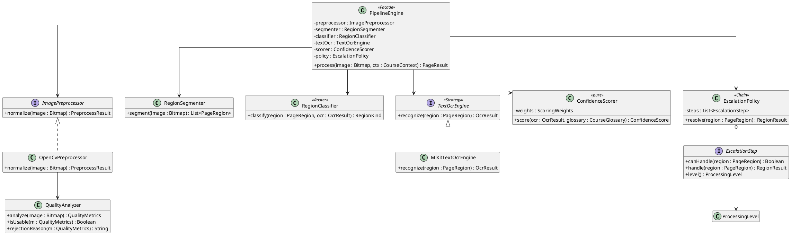
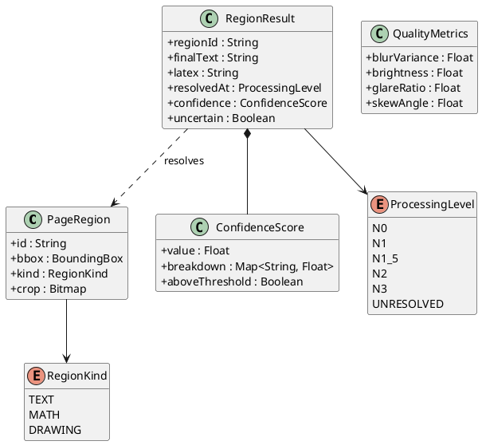
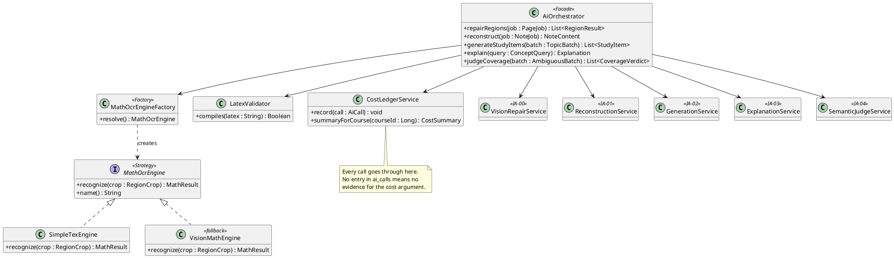
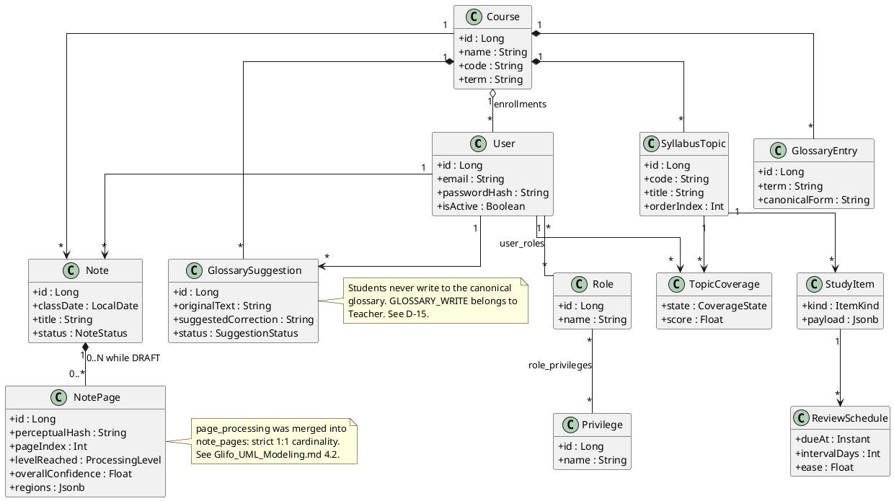
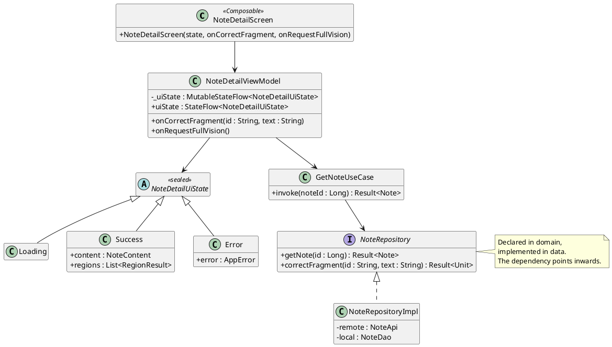

# Glifo — Architecture and Standards

**Team X-Ray** — Brandon Brenes · David González · Felipe Ugalde
Technical reference document · version 2.2

> Defines **how** Glifo is built: layers, package structure, classes, patterns, coding conventions, and work standards.
>
> · `Glifo_Alcance.md` — what is built
> · `Glifo_Diseno_Arquitectura.md` — version for consultation with the professor
> · `Glifo_UML_Modeling.md` — full modeling package and API seam
> · `Glifo_Bitacora_Decisiones.md` — historical record of decisions

---

## Index

1. [Architecture Overview](#1-architecture-overview)
2. [Package Structure — Android](#2-package-structure--android)
3. [Package Structure — Backend](#3-package-structure--backend)
4. [Class Diagrams](#4-class-diagrams)
5. [Applied Design Patterns](#5-applied-design-patterns)
6. [Data Model](#6-data-model)
7. [Coding Conventions](#7-coding-conventions)
8. [REST Conventions](#8-rest-conventions)
9. [Error Handling](#9-error-handling)
10. [Testing Standards](#10-testing-standards)
11. [Git Workflow](#11-git-workflow)
12. [Visual Identity and Design Tokens](#12-visual-identity-and-design-tokens)
- [Annex — Pre-Pull-Request checklist](#annex--pre-pull-request-checklist)

---

## 1. Architecture Overview

### 1.1 Topology

~~~text
┌──────────────────────────────────────────────────────────┐
│  ANDROID CLIENT                                           │
│  Kotlin · Jetpack Compose · MVVM · Hilt                   │
│                                                            │
│  ┌────────────────────────────────────────────────────┐  │
│  │ PRESENTATION   Composables · ViewModels · UiState  │  │
│  ├────────────────────────────────────────────────────┤  │
│  │ DOMAIN         Models · UseCases · Interfaces      │  │
│  ├────────────────────────────────────────────────────┤  │
│  │ DATA           Repositories · Room · Retrofit      │  │
│  ├────────────────────────────────────────────────────┤  │
│  │ PIPELINE       OpenCV · ML Kit · Confidence        │  │
│  └────────────────────────────────────────────────────┘  │
└───────────────────────────┬──────────────────────────────┘
                            │ HTTPS · JSON (Gson) · JWT
┌───────────────────────────▼──────────────────────────────┐
│  BACKEND — Monolithic Spring Boot (Kotlin)                │
│                                                            │
│  ┌────────────────────────────────────────────────────┐  │
│  │ WEB            Controllers · DTOs · Validation     │  │
│  ├────────────────────────────────────────────────────┤  │
│  │ SERVICE        Business Logic · AI Orchestration   │  │
│  ├────────────────────────────────────────────────────┤  │
│  │ PERSISTENCE    Repositories · Entities · JPA       │  │
│  └────────────────────────────────────────────────────┘  │
│                                                            │
│  PostgreSQL (Relational + JSONB)                          │
└──────────────────────────────────────────────────────────┘
~~~

### 1.2 Dependency Rules

The direction of dependencies is **always inwards**:

~~~text
Presentation → Domain ← Data
~~~

- **Domain depends on nothing.** It knows nothing about Android, Room, Retrofit, or Spring. It is pure Kotlin.
- **Data implements domain interfaces.** The domain declares `NoteRepository`; the data layer provides `NoteRepositoryImpl`.
- **Presentation consumes the domain**, never the data layer directly.

### 1.3 Execution Boundaries

| Responsibility | Client | Backend | Reason |
|---|---|---|---|
| Image preprocessing (N0) | ✓ | | Reduces data before transmission |
| Text OCR (N1) | ✓ | | ML Kit is local and free |
| Region classification | ✓ | | Depends on N1 outcome |
| Confidence scoring | ✓ | | Pure function, no dependencies |
| Math OCR (N1.5) | | ✓ | Requires external service credentials |
| Vision repair (N2, N3) | | ✓ | Requires external service credentials |
| Coverage pre-filter | ✓ | | Deterministic, works offline |
| Semantic adjudication | | ✓ | Requires external service credentials |
| Spaced repetition | ✓ | | Deterministic, works offline |

**Absolute rule:** No external service credential ever exists in the APK.

---

## 2. Package Structure — Android

Root package: `cr.ac.una.glifo`

~~~text
cr.ac.una.glifo/
│
├── GlifoApplication.kt              @HiltAndroidApp
├── MainActivity.kt
│
├── di/                              Hilt Modules
│
├── core/                            Cross-cutting, no business logic
│   ├── common/                      Result.kt · AppError.kt · Constants.kt
│   ├── network/                     ApiClient.kt · AuthInterceptor.kt · ErrorMapper.kt
│   ├── database/                    GlifoDatabase.kt · Converters.kt · dao/ · entity/
│   ├── sync/                        SyncManager.kt · SyncWorker.kt · RetryPolicy.kt · SyncOperation.kt
│   └── ui/                          theme/ · component/
│
├── pipeline/                        ◄── THE DIFFERENTIATOR, at the top level
│   ├── PipelineEngine.kt            Facade
│   ├── model/                       PageRegion.kt · RegionKind.kt · ProcessingLevel.kt · CourseContext.kt
│   ├── preprocess/                  ImagePreprocessor.kt · OpenCvPreprocessor.kt · QualityAnalyzer.kt
│   ├── segment/                     RegionSegmenter.kt · RegionClassifier.kt
│   ├── ocr/                         TextOcrEngine.kt · MlKitTextOcrEngine.kt
│   ├── confidence/                  ConfidenceScorer.kt · ScoringWeights.kt
│   ├── escalation/                  EscalationPolicy.kt · EscalationStep.kt
│   └── hash/                        PerceptualHasher.kt
│
├── engine/                          Deterministic local engines, outside the pipeline
│   ├── coverage/                    CoverageEngine.kt      local coverage pre-filter
│   └── srs/                         SrsScheduler.kt        deterministic spaced repetition
│
└── feature/                         One package per capability
    ├── auth/
    ├── capture/
    ├── note/
    ├── coverage/
    ├── study/
    ├── course/                      Teacher-side courses, syllabus, glossary
    └── admin/                       Users, roles
~~~

### Feature Module Convention

Every package under `feature/` replicates the same three-layer structure:

~~~text
feature/<n>/
├── data/
│   ├── remote/      <X>Api.kt + DTOs + mappers
│   ├── local/       DAO + Room entities
│   └── <X>RepositoryImpl.kt
├── domain/
│   ├── model/       Domain models (pure data classes)
│   ├── <X>Repository.kt
│   └── usecase/     One file per use case
└── presentation/
    ├── <X>Screen.kt
    ├── <X>ViewModel.kt
    └── <X>UiState.kt
~~~

---

## 3. Package Structure — Backend

Root package: `cr.ac.una.glifo`

Organized **by aggregate**, not by technical layer. Source root is `src/main/kotlin`. All files end in `.kt`.

~~~text
cr.ac.una.glifo/
│
├── GlifoApplication.kt
│
├── config/                          SecurityConfig.kt · OpenApiConfig.kt
├── common/                          exception/ · response/ · audit/
├── security/                        JwtTokenProvider.kt · JwtAuthenticationFilter.kt
│
├── user/                            One package per aggregate
│   ├── controller/UserController.kt
│   ├── service/UserService.kt
│   ├── repository/UserRepository.kt
│   ├── entity/User.kt · Role.kt · Privilege.kt
│   ├── dto/UserRequest.kt · UserResponse.kt
│   └── mapper/UserMappers.kt        (top-level extension functions)
│
├── course/                          courses · enrollments · syllabus_topics · glossary · glossary_suggestions
├── note/                            notes · pages
├── study/                           coverage · items · attempts · schedule
│
├── ai/                              ◄── ORCHESTRATION
│   ├── AiOrchestrator.kt            Facade
│   ├── engine/                      MathOcrEngine.kt · SimpleTexEngine.kt · VisionMathEngine.kt
│   │                                MathOcrEngineFactory.kt
│   ├── service/                     VisionRepairService.kt      IA-00
│   │                                ReconstructionService.kt    IA-01
│   │                                GenerationService.kt        IA-02
│   │                                ExplanationService.kt       IA-03
│   │                                SemanticJudgeService.kt     IA-04
│   ├── prompt/                      PromptBuilder.kt
│   ├── validation/                  LatexValidator.kt
│   └── ledger/                      CostLedgerService.kt · AiCall.kt
│
└── notification/                    PushService.kt · DeviceController.kt
~~~

The five services under `ai/service/` map one to one onto the AI call inventory in `Glifo_Alcance.md` §8. If a service is missing here, the corresponding AI function has no home.

---

## 4. Class Diagrams

Diagrams are written in **PlantUML**. To render them: the *PlantUML Integration* plugin in Android Studio or IntelliJ, the *PlantUML* extension in VS Code, or the public server at `plantuml.com/plantuml`. Standalone `.puml` files are versioned in `docs/uml/`, one file per diagram, named after the `@startuml` identifier.

The four diagrams below are the ones that govern **how code is written**. The full modeling package —ERD, sequence diagrams, navigation maps, API seam— lives in `Glifo_UML_Modeling.md`.

### 4.1 Ingestion pipeline — the core

**Pipeline data contracts**

> `RegionResult` carries `finalText` and `latex` as a nullable pair rather than a sealed hierarchy. Tolerated because it serializes flat into JSONB. Revisit only if a third content type appears.

### 4.2 AI orchestration in the backend

### 4.3 Core domain

### 4.4 Presentation layer (per-screen pattern)

**This is the canonical screen.** Every other screen replicates the same five pieces: stateless Composable, ViewModel exposing one immutable `StateFlow<UiState>`, a sealed `UiState`, a use case, and a repository interface owned by the domain.

---

## 5. Applied Design Patterns

| Pattern | Where | Why |
|---|---|---|
| **Chain of Responsibility** | `EscalationPolicy` with `EscalationStep` | The N0→N1→N1.5→N2→N3 ladder is a chain. Each link decides whether to resolve or delegate. |
| **Strategy** | `MathOcrEngine`, `TextOcrEngine` | Concrete engines are interchangeable. |
| **Factory** | `MathOcrEngineFactory` | Resolves which implementation to use based on configuration. |
| **Repository** | All features, both tiers | Isolates domain from data origins (Room, Network, Postgres). |
| **Facade** | `PipelineEngine`, `AiOrchestrator` | Single entry point to complex subsystems. |
| **Adapter / Mapper** | `*Mappers.kt` | Extension functions mapping DTOs ↔ domain ↔ entities. Prevents leakage across boundaries. |
| **Observer** | `StateFlow` in ViewModels | UI reacts to state changes without polling. |
| **Builder** | `PromptBuilder` | Composes prompts combining context, limits, and glossary rules. |

**Note on Builder under Kotlin (D-13).** Kotlin's named and default arguments cover most of what a Builder was for. `PromptBuilder` survives because it accumulates state across conditional branches, which named arguments do not do.

---

## 6. Data Model

### 6.1 Conventions

| Rule | Detail |
|---|---|
| Language | English for tables, columns, indexes, constraints |
| Tables | Plural, `snake_case` (e.g., `notes`, `note_pages`) |
| `users` | Always plural (`user` is a reserved word in Postgres) |
| Primary Key | `id BIGSERIAL PRIMARY KEY` |
| Foreign Key | `<singular_entity>_id` (e.g., `course_id`) |
| Unique Constraints | Enforced at the DB level for relational integrity (e.g., `user_id` + `course_id` in enrollments). Exact definitions live in the ERD. |
| Audit | `created_at`, `updated_at` on mutable entities |
| Booleans | Prefix `is_` or `has_` |
| Enums | `VARCHAR` with `CHECK` constraints |

**Size.** 16 core tables on the defended diagram plus a 5-table operations annex, 21 total. The reduction from 23 is justified merge by merge in `Glifo_UML_Modeling.md` §4.2.

### 6.2 JSONB Criteria

JSONB is used **only** when the structure is variable **and** no internal field is queried or aggregated. If either half fails, the data is normalized.

| Used For | Reason |
|---|---|
| `note_pages.regions` | Variable number and shape of regions per page. |
| `note_pages.quality_metrics` | The metric set grows as N0 improves; read whole, never filtered. |
| `notes.content` | Reconstructed note is a document tree. |
| `study_items.payload` | Structure differs completely by item kind. |
| `attempts.response` | Response format depends on question type. |
| `sync_queue.payload` | Serialized outbox operation. |
| `notifications.payload` | Payload shape depends on notification kind. |
| `coverage_snapshots.summary` | Reporting-only freeze; never queried by field. |

**Not used for:** `topic_coverage`, `users`, `roles`, `privileges`, `ai_calls` — these require strict referential integrity or are aggregated constantly.

### 6.3 Schema Highlights

**Notes & Ingestion**
- `notes`: Includes `status` (`DRAFT`, `PROCESSING`, `READY`, `ARCHIVED`) to support the 0..N page cardinality during offline capture (D-16).
- `note_pages`: absorbs the former `page_processing` table — strict 1:1 cardinality, so the join bought nothing.
- `sync_queue`: Includes `device_id` so FCM push notifications only target the physical device that uploaded the pending batch (D-18).

**Study & Dictionary**
- `study_items.payload`: collapsing questions, options, and correct answers into JSONB removed four normalized tables from the quiz model. A `CHECK` constraint keeps the `kind` discriminator and the payload honest.
- `glossary_suggestions`: Replaces direct write access to `course_glossary`. Students create suggestions when correcting fragments, keeping the `GLOSSARY_WRITE` boundary with teachers (D-15).
- `LocalCourseContext`: Synchronized to Room for offline pipeline execution. Stores `course_id`, `course_name`, `syllabus_version`, `glossary_version`, and `glossary_entries` so the local `ConfidenceScorer` can function and the cache can be invalidated on reconnect (D-17).

---

## 7. Coding Conventions

### 7.1 Kotlin — Android

| Element | Convention | Example |
|---|---|---|
| Class, Interface | `PascalCase` | `ConfidenceScorer` |
| Function, Property | `camelCase` | `calculateScore()` |
| Constant | `UPPER_SNAKE_CASE` | `DEFAULT_THRESHOLD` |
| Composable | `PascalCase` | `NoteDetailScreen()` |
| Test Method | `should <do> when <condition>` | ``fun `should mark uncertain when latex fails`()`` |

**Compose Rules**
- Composables are **stateless**. State is hoisted to the ViewModel.
- Every screen exposes a single immutable `UiState`.
- Prefix `on` for event lambdas: `onCorrectFragment`.

**ViewModel & Domain Rules**
- Expose immutable `StateFlow<UiState>`.
- I/O operations are suspendable and are invoked through domain use cases/repositories. ViewModels launch them using `viewModelScope`.
- Domain models are pure immutable `data class`.

### 7.2 Kotlin — Backend

| Element | Convention | Example |
|---|---|---|
| Entity | Singular, `PascalCase` | `NotePage` |
| Controller | `<Resource>Controller` | `NoteController` |
| Service | `<Resource>Service` | `NoteService` |
| Input DTO | `<Action>Request` | `CreateNoteRequest` |
| Output DTO | `<Resource>Response` | `NoteResponse` |

**Backend Layer Rules**
- **Controllers** have no business logic.
- **Services** contain business logic and open transactions (`@Transactional`).
- **Entities never cross the HTTP boundary**. They must be mapped to DTOs.
- **Injection by primary constructor**, never `@Autowired` on fields.

**The Entity Trap (Important)**
- A JPA `@Entity` must **not** be a `data class`. `data class` automatically generates `equals`/`hashCode` and `toString` encompassing all fields, which breaks Hibernate lazy-loading proxies and collections. Use plain `class` with `var` properties.
- DTOs **should** be `data class`.

**The compiler-plugin trap (D-13).** `kotlin-spring` (opens `final` classes so Spring can proxy them) and `kotlin-jpa` (generates the no-arg constructor JPA requires) are mandatory. Generate the project from `start.spring.io` with Kotlin + Gradle selected, which wires them correctly, rather than converting a Java skeleton by hand.

**Canonical Controller Example (Kotlin)**
~~~kotlin
@RestController
@RequestMapping("/api/v1/notes")
class NoteController(
    private val noteService: NoteService
) {
    @PostMapping
    fun create(@Valid @RequestBody request: CreateNoteRequest): ResponseEntity<NoteResponse> =
        ResponseEntity.status(HttpStatus.CREATED).body(noteService.create(request))
}
~~~

### 7.3 Language Rule (D-14)

**Language:** Code, identifiers, database objects, API paths, JSON payload fields, commit messages, and technical documentation are written in **English**.
**User-facing interface text is written in Spanish**, because the end-users are Spanish-speaking students. UI strings live in `res/values-es/strings.xml`, with `res/values/strings.xml` acting as the English default — which also satisfies the internationalization requirement in Module 3 of the course programme.

---

## 8. REST Conventions

### 8.1 Route Structure

~~~text
/api/v1/<plural-resource>
~~~
- Plural nouns, `kebab-case` for routes, `camelCase` for JSON body.
- Pagination via query params: `?page=0&size=20`.

### 8.2 Status Codes

| Code | Use |
|---|---|
| `200` | Success with body |
| `201` | Resource created — includes `Location` header |
| `204` | Success without body |
| `400` | Validation failed |
| `401` | Not authenticated |
| `403` | Authenticated but lacking the privilege |
| `404` | Resource does not exist |
| `409` | State conflict |
| `422` | Semantically invalid |
| `429` | Consumption limit exceeded |
| `500` | Unhandled error |

### 8.3 Response Envelope

**Success:**
~~~json
{ "data": { }, "meta": { "page": 0, "size": 20, "total": 137 } }
~~~

**Error:**
~~~json
{
  "error": {
    "code": "VALIDATION_ERROR",
    "message": "Course name is required",
    "details": [{ "field": "name", "issue": "cannot be empty" }],
    "timestamp": "2026-09-15T14:32:10Z",
    "path": "/api/v1/courses"
  }
}
~~~

---

## 9. Error Handling

### 9.1 Backend

All exceptions are routed through a single `@RestControllerAdvice`.

~~~kotlin
@RestControllerAdvice
class GlobalExceptionHandler {

    @ExceptionHandler(ResourceNotFoundException::class)
    fun handleNotFound(ex: ResourceNotFoundException): ResponseEntity<ApiError> = TODO()

    @ExceptionHandler(MethodArgumentNotValidException::class)
    fun handleValidation(ex: MethodArgumentNotValidException): ResponseEntity<ApiError> = TODO()

    @ExceptionHandler(Exception::class)
    fun handleUnexpected(ex: Exception): ResponseEntity<ApiError> = TODO()
}
~~~

**Rules**
- Never return a stack trace to the client.
- Never return the raw message of an infrastructure exception.
- Always log errors with a correlation ID.

### 9.2 Android

Errors are modeled as types, not as exceptions propagating uncontrolled.

~~~kotlin
sealed interface AppError {
    data object NoConnection : AppError
    data object Unauthorized : AppError
    data class Validation(val field: String, val issue: String) : AppError
    data class Server(val code: String, val message: String) : AppError
    data object Unknown : AppError
}

sealed interface Result<out T> {
    data class Success<T>(val value: T) : Result<T>
    data class Failure(val error: AppError) : Result<Nothing>
}
~~~

`ErrorMapper` translates HTTP codes into `AppError`. The presentation layer decides how to show it. **A network error is never presented as an application error.**

### 9.3 Pipeline-specific errors

The pipeline **does not throw exceptions on unreadable content**. It returns a result with `uncertain = true` and the reason. Failing to read is not a system error: it is information the user must see.

This is the technical expression of the product's central promise. An exception thrown here would surface as a generic error screen, and the student would lose the one thing the application exists to tell them.

---

## 10. Testing Standards

### 10.1 Priorities

| Component | Type | Priority | Reason |
|---|---|---|---|
| `ConfidenceScorer` | Unit | **High** | Pure function; the calibration set is the fixture |
| `EscalationPolicy` | Unit | **High** | Central decision logic |
| `RegionClassifier` | Unit | High | Routing errors affect the whole flow |
| `RetryPolicy` / `SyncQueue` | Unit | High | Corresponds to the applied research topic |
| Use cases | Unit | Medium | With mocked repositories |
| Controllers | Integration | Medium | `MockMvc` |
| ViewModels | Unit | Medium | With `Turbine` over `StateFlow` |
| Composables | Instrumented | Low | Expensive; critical screens only |

### 10.2 Tools

- **Android:** JUnit 5, MockK, Turbine, `kotlinx-coroutines-test`.
- **Backend:** JUnit 5, MockK, `spring-boot-starter-test`, MockMvc. *(Mockito was replaced by MockK under D-13: Mockito cannot mock Kotlin `final` classes without an extra agent.)*
- **API:** Postman collection versioned in the repository.

### 10.3 Convention

Given/When/Then structure, descriptive names in English (D-14):

~~~kotlin
@Test
fun `should escalate to N2 when confidence is below threshold`() {
    // given
    // when
    // then
}
~~~

---

## 11. Git Workflow

### 11.1 Branches

~~~text
main            Always compiles and deploys. Protected.
develop         Team continuous integration.
feature/<x>     Work in progress.
fix/<x>         Corrections.
~~~

| Prefix | Use | Example |
|---|---|---|
| `feature/` | New capability | `feature/confidence-scorer` |
| `fix/` | Correction | `fix/camera-rotation` |
| `chore/` | Configuration, dependencies | `chore/hilt-setup` |
| `docs/` | Documentation | `docs/architecture` |

### 11.2 Commit Messages

**Conventional Commits**:

~~~text
<type>(<scope>): <description in imperative>

feat(pipeline): add region classifier
fix(sync): prevent duplicates on queue retry
docs(arch): document the escalation policy
test(confidence): cover the escalation threshold
~~~

Types: `feat` · `fix` · `docs` · `test` · `refactor` · `chore`.

### 11.3 Rules

- **Nobody pushes directly to `main`.**
- Every branch enters through a Pull Request with at least **one review** from another member.
- The branch must compile before review is requested.
- One PR resolves one concern.
- **Why review is mandatory:** the grade is individual and there are two oral defenses. Reviewing each other's code is how each member understands the parts they did not write.

### 11.4 Work Fronts

| Front | Scope |
|---|---|
| **A — Client** | Compose, navigation, roles in UI, Hilt, Retrofit, confidence map |
| **B — Backend** | Spring Boot, Postgres, Repository, DTOs, JWT, Postman, deployment |
| **C — Engine** | OpenCV, ML Kit, ladder, Room, sync queue, push, applied research |

Fronts define primary responsibility, not exclusivity. Everyone reviews everyone's work.

---

## 12. Visual Identity and Design Tokens

### 12.1 Concept

**Glifo** — the glyph is the minimum unit of writing; the griffin (*grifo*), its guardian. The visual identity is built on the mythological griffin: eagle's head (sharp sight, reading what is hard to read) and lion's body (guardian of a treasure).

**Legal constraint:** aesthetic inspiration cannot include third-party intellectual property symbols. The mythological griffin is public domain.

### 12.2 Color System

Glifo defines **two complete modes**, Night and Day. It is not a dark theme with a light variant added afterwards: both modes declare the same set of tokens and differ only in values. No component knows the active mode; all of them read tokens.

The slate blue comes from the griffin's body and the gold from its heraldic character. The palette deliberately departs from the default purple of AI design tools.

**Surface and text tokens**

| Token | Night | Day | Use |
|---|---|---|---|
| `background` | `#161E27` | `#EDEAE0` | App background |
| `surface` | `#2E3B4B` | `#F7F4EC` | Cards, top bar, elevated surfaces |
| `surfaceHigh` | `#3B4A5C` | `#D7D1B9` | Inner fill over `surface`: progress bar tracks, fields, crops |
| `border` | `#4A5A6E` | `#C4BCA3` | Card outline, separators, field border |
| `textPrimary` | `#D7D1B9` | `#2E3B4B` | Main text |
| `textSecondary` | `#959595` | `#63666A` | Secondary text, metadata, captions |
| `scrim` | `rgba(8,12,17,.72)` | `rgba(46,59,75,.5)` | Veil under dialogs and modal sheets |

**Accent tokens**

| Token | Night | Day | Use |
|---|---|---|---|
| `accent` | `#FFD372` | `#FFD372` | Primary action fill, active indicator, progress bar |
| `accentText` | `#FFD372` | `#8A6210` | The accent applied to text or icon over a background, with sufficient contrast |
| `onAccent` | `#1A1206` | `#2E3B4B` | Text and icon over an accent fill |
| `accentSoft` | `rgba(255,211,114,.16)` | `rgba(196,143,20,.20)` | Chip or active label background |
| `accentFaint` | `rgba(255,211,114,.08)` | `rgba(196,143,20,.10)` | Selected row background |
| `accentLine` | `rgba(255,211,114,.42)` | `rgba(160,116,15,.5)` | Active element border |
| `btnSecBorder` | `#FFD372` | `#A07413` | Secondary button outline |
| `btnSecText` | `#FFD372` | `#8A6210` | Secondary button text |

> **`accent` and `accentText` are different tokens.** In Day mode `accent` stays `#FFD372` because it is a *fill*, with `onAccent` sitting on top of it. `accentText` darkens to `#8A6210` because it is gold used *as text or icon over a background*. Collapsing the two turns every primary button in Day mode brown.

**Alert tokens**

| Token | Night | Day |
|---|---|---|
| `alert` | `#E0693A` | `#B94117` |
| `alertSoft` | `rgba(224,105,58,.18)` | `rgba(185,65,23,.14)` |
| `alertFaint` | `rgba(224,105,58,.09)` | `rgba(185,65,23,.07)` |
| `alertLine` | `rgba(224,105,58,.45)` | `rgba(185,65,23,.42)` |

**Variant convention.** Every semantic color exposes up to four derived forms under the same criterion:

| Suffix | Night opacity | Day opacity | For what |
|---|---|---|---|
| — | 1.0 | 1.0 | Text, icon, stroke |
| `Soft` | .16 – .20 | .14 | Chip, label, or highlight fill |
| `Faint` | .08 – .10 | .07 | Row or block background |
| `Line` | .42 – .45 | .38 – .50 | Border |

`neutralSoft` (`rgba(149,149,149,.18)` Night, `rgba(99,102,106,.14)` Day) covers fills with no semantic load.

### 12.2.1 Accent usage rules

**Gold is the color of action, not of the brand.** The `heraldic` token is gone: heraldic gold and the accent are now the same color, so gold cannot be used as brand decoration without destroying the signal.

- If an element is gold, **it can be touched or it is active**. No decorative exceptions.
- Brand identity rests on the griffin logo, not on a reserved color.
- Over an accent fill use `onAccent`; the accent as text over a background uses `accentText`. Never `#FFD372` as text over a light background.
- **The Glifo logo must not use `accentText`.** It uses a neutral or primary text color, to preserve the rule that gold means interaction.

### 12.3 Confidence states

A functional scale, not a decorative one. It is the visual vocabulary of the confidence map, and **every state is coded by color and by non-chromatic form simultaneously.**

| State | Night | Day | Meaning | Level |
|---|---|---|---|---|
| **Verified** | `#5FA88C` | `#2F7D62` | Local OCR, high confidence | N1 |
| **Repaired** | `#8FB7DC` | `#3E6E9E` | Formula resolved into LaTeX | N1.5 |
| **Escalated** | `#F59E0B` | `#D97706` | Required a vision model | N2 |
| **Alert** | `#E0693A` | `#B94117` | Destructive / error | — |
| **Uncertain** | `#959595` | `#63666A` | Nobody read it with certainty | UNR |

Each state exposes the `Soft`, `Faint`, and `Line` variants per §12.2.

**Escalated is separate from alert (D-12).** Escalating to vision is normal pipeline operation, not a failure. Presenting it in the error color would contradict the product's own argument. The previously shared value (`#E0693A` / `#B94117` for both) must not be reintroduced. Applied in the documents and in all eight prototype files.

**Inline text coding.** Note fragments are marked with underline and fill, not color alone:

| State | Underline | Fill |
|---|---|---|
| Verified | Solid 2 px | None |
| Repaired | Solid 2 px | `repairedSoft` |
| Escalated | Solid 2 px | `escalatedFaint` |
| Uncertain | **Dotted** 2 px | `uncertainSoft` |

**Label coding.** Every fragment not resolved at N1 also carries a textual label with state and level —`REPAIRED · N1.5`, `ESCALATED · N2`, `UNCERTAIN`— and the note header summarizes the distribution (`14 verified · 2 repaired · 1 escalated · 1 uncertain`).

**Why dual coding:** roughly 8 % of men have some color vision deficiency, and the green/amber pair is the worst discriminated. If the confidence map depended on color alone, the central function of the application would be inaccessible to those users. That is why color is never the sole carrier: the textual label always accompanies it.

**On geometric coding.** The earlier scheme —filled circle, square, triangle, dotted circle— did not survive contact with inline text: there is nowhere to put a triangle inside a paragraph. Inside running text it is replaced by the underline + fill + label combination above. Geometric markers remain valid as compact status chips in lists and headers, where there is room for them, but they are never the only carrier there either.

### 12.4 Typography and spacing

| Element | Value |
|---|---|
| Family | Inter, with the system typeface as fallback |
| Title | 22 sp · weight 500 |
| Subtitle | 18 sp · weight 500 |
| Body | 16 sp · weight 400 |
| Secondary | 14 sp · weight 400 |
| Caption and metadata | 12 – 13 sp · weight 400 |
| Status label | 11 sp · weight 600 · small caps with `letter-spacing` 0.5 |
| Formulas | Monospaced —JetBrains Mono or Roboto Mono— for raw LaTeX |
| Spacing scale | 4 · 8 · 12 · 16 · 24 · 32 dp |
| Corner radius | 8 dp controls and labels · 12 dp cards · 3 dp fragment highlight · full on pills and bars |
| Control height | **48 dp button · 56 dp top bar** |

The 48 dp button and 56 dp top bar heights are strict and override any prototype component modeled at other values.

### 12.5 Interface rules

- **A note is never shown without its confidence indicator.**
- **The original crop is always available** next to every transcribed formula.
- When a capture is rejected, **the concrete reason** is stated, never a generic message.
- The pipeline level that resolved each region is inspectable from the interface.

---

## Annex — Pre-Pull-Request checklist

- [ ] It compiles and the tests pass
- [ ] No credentials or development URLs in the code
- [ ] Names in English; entities and tables conform to §6.1
- [ ] No JPA entity exposed over HTTP
- [ ] Constructor injection
- [ ] No business logic in controllers or composables
- [ ] Errors modeled, not propagated uncontrolled
- [ ] No magic numbers
- [ ] Commits in the §11.2 format
- [ ] The domain does not import Android, Room, Retrofit, or Spring
- [ ] No `@Entity` declared as `data class` (§7.2)
- [ ] UI strings in `res/values-es/strings.xml`, not hardcoded (§7.3)
