# Glifo — Diagramas PlantUML (paquete consolidado)

## 01_stack_deployment.puml
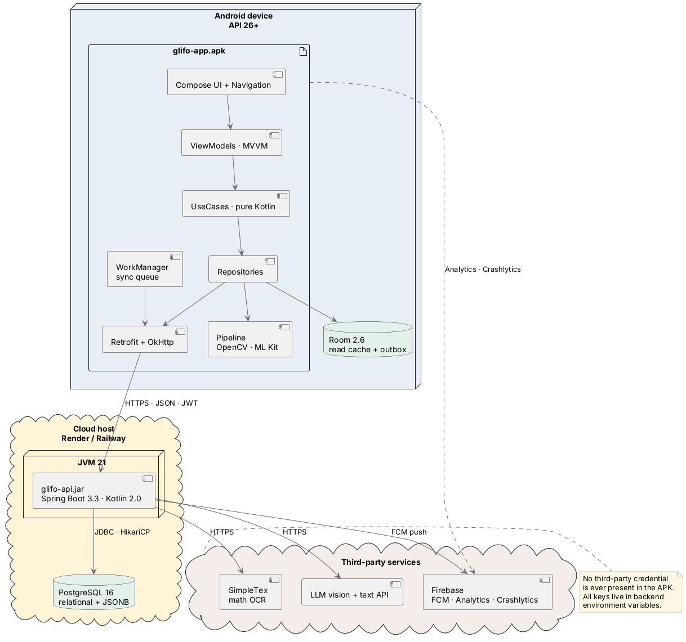
```plantuml
@startuml 01_stack_deployment
skinparam backgroundColor #FFFFFF
skinparam shadowing false
skinparam noteBackgroundColor #FDF6E3
skinparam noteBorderColor #C4BCA3
skinparam defaultFontName Inter
skinparam ArrowColor #63666A
hide empty members

node "Android device\nAPI 26+" as device #E8EEF6 {
  artifact "glifo-app.apk" as apk {
    component "Compose UI + Navigation" as ui
    component "ViewModels · MVVM" as vm
    component "UseCases · pure Kotlin" as uc
    component "Repositories" as repo
    component "Pipeline\nOpenCV · ML Kit" as pipe
    component "Retrofit + OkHttp" as retro
    component "WorkManager\nsync queue" as work
  }
  database "Room 2.6\nread cache + outbox" as room #E4F0EA
}

cloud "Cloud host\nRender / Railway" as cloudhost #FFF3D8 {
  node "JVM 21" as jvm {
    component "glifo-api.jar\nSpring Boot 3.3 · Kotlin 2.0" as api
  }
  database "PostgreSQL 16\nrelational + JSONB" as pg #E4F0EA
}

cloud "Third-party services" as ext #F5EDE9 {
  component "SimpleTex\nmath OCR" as simpletex
  component "LLM vision + text API" as llm
  component "Firebase\nFCM · Analytics · Crashlytics" as fb
}

ui --> vm
vm --> uc
uc --> repo
repo --> pipe
repo --> retro
repo --> room
work --> retro
retro --> api : HTTPS · JSON · JWT
api --> pg : JDBC · HikariCP
api --> simpletex : HTTPS
api --> llm : HTTPS
api --> fb : FCM push
apk ..> fb : Analytics · Crashlytics

note right of ext
  No third-party credential
  is ever present in the APK.
  All keys live in backend
  environment variables.
end note
@enduml
```

## 02_erd_core.puml
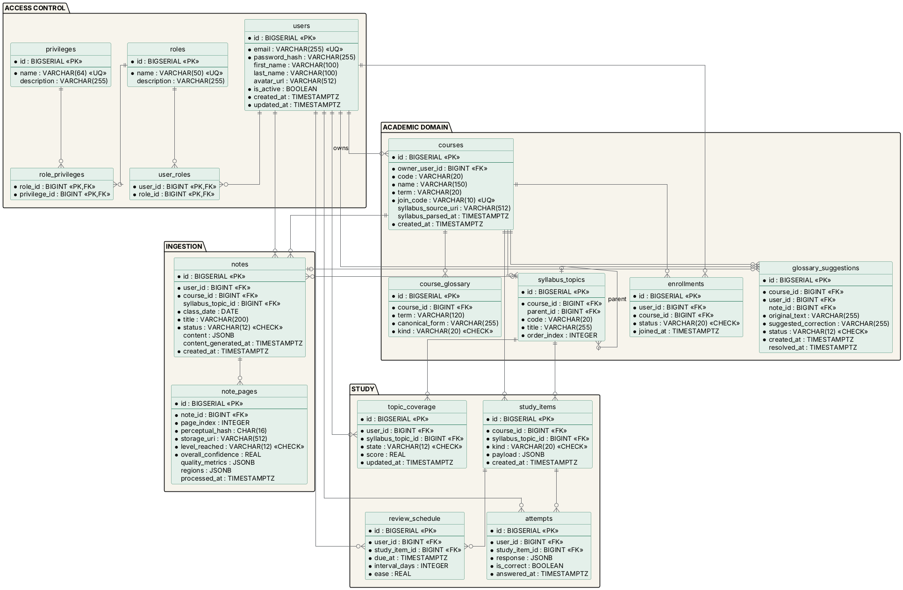
```plantuml
@startuml 02_erd_core
skinparam backgroundColor #FFFFFF
skinparam shadowing false
skinparam noteBackgroundColor #FDF6E3
skinparam noteBorderColor #C4BCA3
skinparam linetype ortho
skinparam defaultFontName Inter
skinparam ArrowColor #63666A
skinparam class {
  BackgroundColor #E4F0EA
  BorderColor #2F7D62
  FontName Inter
}
hide circle
hide methods

package "ACCESS CONTROL" as pkgAccess #F7F4EC {
  entity users {
    * id : BIGSERIAL <<PK>>
    --
    * email : VARCHAR(255) <<UQ>>
    * password_hash : VARCHAR(255)
    first_name : VARCHAR(100)
    last_name : VARCHAR(100)
    avatar_url : VARCHAR(512)
    * is_active : BOOLEAN
    * created_at : TIMESTAMPTZ
    * updated_at : TIMESTAMPTZ
  }
  entity roles {
    * id : BIGSERIAL <<PK>>
    --
    * name : VARCHAR(50) <<UQ>>
    description : VARCHAR(255)
  }
  entity privileges {
    * id : BIGSERIAL <<PK>>
    --
    * name : VARCHAR(64) <<UQ>>
    description : VARCHAR(255)
  }
  entity user_roles {
    * user_id : BIGINT <<PK,FK>>
    * role_id : BIGINT <<PK,FK>>
  }
  entity role_privileges {
    * role_id : BIGINT <<PK,FK>>
    * privilege_id : BIGINT <<PK,FK>>
  }
}

package "ACADEMIC DOMAIN" as pkgCourse #F7F4EC {
  entity courses {
    * id : BIGSERIAL <<PK>>
    --
    * owner_user_id : BIGINT <<FK>>
    * code : VARCHAR(20)
    * name : VARCHAR(150)
    * term : VARCHAR(20)
    * join_code : VARCHAR(10) <<UQ>>
    syllabus_source_uri : VARCHAR(512)
    syllabus_parsed_at : TIMESTAMPTZ
    * created_at : TIMESTAMPTZ
  }
  entity enrollments {
    * id : BIGSERIAL <<PK>>
    --
    * user_id : BIGINT <<FK>>
    * course_id : BIGINT <<FK>>
    * status : VARCHAR(20) <<CHECK>>
    * joined_at : TIMESTAMPTZ
  }
  entity syllabus_topics {
    * id : BIGSERIAL <<PK>>
    --
    * course_id : BIGINT <<FK>>
    parent_id : BIGINT <<FK>>
    * code : VARCHAR(20)
    * title : VARCHAR(255)
    * order_index : INTEGER
  }
  entity course_glossary {
    * id : BIGSERIAL <<PK>>
    --
    * course_id : BIGINT <<FK>>
    * term : VARCHAR(120)
    * canonical_form : VARCHAR(255)
    * kind : VARCHAR(20) <<CHECK>>
  }
  entity glossary_suggestions {
    * id : BIGSERIAL <<PK>>
    --
    * course_id : BIGINT <<FK>>
    * user_id : BIGINT <<FK>>
    note_id : BIGINT <<FK>>
    * original_text : VARCHAR(255)
    * suggested_correction : VARCHAR(255)
    * status : VARCHAR(12) <<CHECK>>
    * created_at : TIMESTAMPTZ
    resolved_at : TIMESTAMPTZ
  }
}

package "INGESTION" as pkgNote #F7F4EC {
  entity notes {
    * id : BIGSERIAL <<PK>>
    --
    * user_id : BIGINT <<FK>>
    * course_id : BIGINT <<FK>>
    syllabus_topic_id : BIGINT <<FK>>
    * class_date : DATE
    * title : VARCHAR(200)
    * status : VARCHAR(12) <<CHECK>>
    content : JSONB
    content_generated_at : TIMESTAMPTZ
    * created_at : TIMESTAMPTZ
  }
  entity note_pages {
    * id : BIGSERIAL <<PK>>
    --
    * note_id : BIGINT <<FK>>
    * page_index : INTEGER
    * perceptual_hash : CHAR(16)
    * storage_uri : VARCHAR(512)
    * level_reached : VARCHAR(12) <<CHECK>>
    * overall_confidence : REAL
    quality_metrics : JSONB
    regions : JSONB
    processed_at : TIMESTAMPTZ
  }
}

package "STUDY" as pkgStudy #F7F4EC {
  entity topic_coverage {
    * id : BIGSERIAL <<PK>>
    --
    * user_id : BIGINT <<FK>>
    * syllabus_topic_id : BIGINT <<FK>>
    * state : VARCHAR(12) <<CHECK>>
    * score : REAL
    * updated_at : TIMESTAMPTZ
  }
  entity study_items {
    * id : BIGSERIAL <<PK>>
    --
    * course_id : BIGINT <<FK>>
    * syllabus_topic_id : BIGINT <<FK>>
    * kind : VARCHAR(20) <<CHECK>>
    * payload : JSONB
    * created_at : TIMESTAMPTZ
  }
  entity attempts {
    * id : BIGSERIAL <<PK>>
    --
    * user_id : BIGINT <<FK>>
    * study_item_id : BIGINT <<FK>>
    * response : JSONB
    * is_correct : BOOLEAN
    * answered_at : TIMESTAMPTZ
  }
  entity review_schedule {
    * id : BIGSERIAL <<PK>>
    --
    * user_id : BIGINT <<FK>>
    * study_item_id : BIGINT <<FK>>
    * due_at : TIMESTAMPTZ
    * interval_days : INTEGER
    * ease : REAL
  }
}

users ||--o{ user_roles
roles ||--o{ user_roles
roles ||--o{ role_privileges
privileges ||--o{ role_privileges

users ||--o{ courses : owns
users ||--o{ enrollments
courses ||--o{ enrollments
courses ||--o{ syllabus_topics
courses ||--o{ course_glossary
courses ||--o{ glossary_suggestions
users ||--o{ glossary_suggestions
syllabus_topics |o--o{ syllabus_topics : parent

users ||--o{ notes
courses ||--o{ notes
syllabus_topics |o--o{ notes
notes ||--o{ note_pages
notes |o--o{ glossary_suggestions

users ||--o{ topic_coverage
syllabus_topics ||--o{ topic_coverage
courses ||--o{ study_items
syllabus_topics ||--o{ study_items
users ||--o{ attempts
study_items ||--o{ attempts
users ||--o{ review_schedule
study_items ||--o{ review_schedule
@enduml
```

## 03_erd_operations.puml
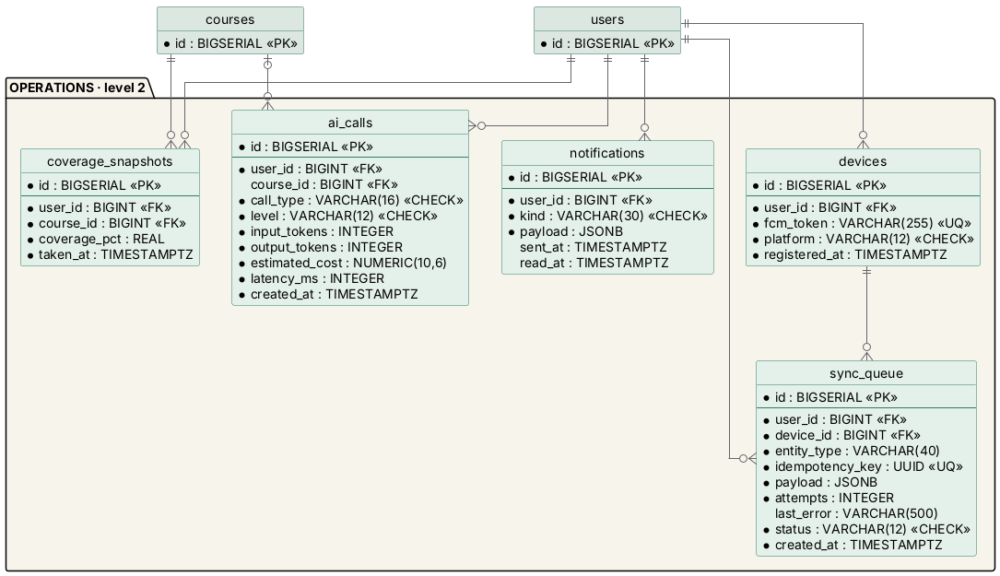
```plantuml
@startuml 03_erd_operations
skinparam backgroundColor #FFFFFF
skinparam shadowing false
skinparam noteBackgroundColor #FDF6E3
skinparam noteBorderColor #C4BCA3
skinparam linetype ortho
skinparam defaultFontName Inter
skinparam ArrowColor #63666A
skinparam class {
  BackgroundColor #E4F0EA
  BorderColor #2F7D62
  FontName Inter
}
hide circle
hide methods

entity users #DDE7E2 {
  * id : BIGSERIAL <<PK>>
}
entity courses #DDE7E2 {
  * id : BIGSERIAL <<PK>>
}

package "OPERATIONS · level 2" #F7F4EC {
  entity ai_calls {
    * id : BIGSERIAL <<PK>>
    --
    * user_id : BIGINT <<FK>>
    course_id : BIGINT <<FK>>
    * call_type : VARCHAR(16) <<CHECK>>
    * level : VARCHAR(12) <<CHECK>>
    * input_tokens : INTEGER
    * output_tokens : INTEGER
    * estimated_cost : NUMERIC(10,6)
    * latency_ms : INTEGER
    * created_at : TIMESTAMPTZ
  }
  entity sync_queue {
    * id : BIGSERIAL <<PK>>
    --
    * user_id : BIGINT <<FK>>
    * device_id : BIGINT <<FK>>
    * entity_type : VARCHAR(40)
    * idempotency_key : UUID <<UQ>>
    * payload : JSONB
    * attempts : INTEGER
    last_error : VARCHAR(500)
    * status : VARCHAR(12) <<CHECK>>
    * created_at : TIMESTAMPTZ
  }
  entity devices {
    * id : BIGSERIAL <<PK>>
    --
    * user_id : BIGINT <<FK>>
    * fcm_token : VARCHAR(255) <<UQ>>
    * platform : VARCHAR(12) <<CHECK>>
    * registered_at : TIMESTAMPTZ
  }
  entity notifications {
    * id : BIGSERIAL <<PK>>
    --
    * user_id : BIGINT <<FK>>
    * kind : VARCHAR(30) <<CHECK>>
    * payload : JSONB
    sent_at : TIMESTAMPTZ
    read_at : TIMESTAMPTZ
  }
  entity coverage_snapshots {
    * id : BIGSERIAL <<PK>>
    --
    * user_id : BIGINT <<FK>>
    * course_id : BIGINT <<FK>>
    * coverage_pct : REAL
    * taken_at : TIMESTAMPTZ
  }
}

users ||--o{ ai_calls
users ||--o{ sync_queue
devices ||--o{ sync_queue
users ||--o{ devices
users ||--o{ notifications
users ||--o{ coverage_snapshots
courses |o--o{ ai_calls
courses ||--o{ coverage_snapshots
@enduml
```

## 04_erd_access_control.puml
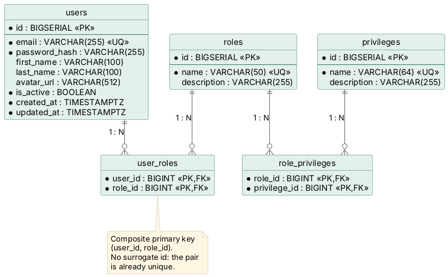
```plantuml
@startuml 04_erd_access_control
skinparam backgroundColor #FFFFFF
skinparam shadowing false
skinparam noteBackgroundColor #FDF6E3
skinparam noteBorderColor #C4BCA3
skinparam linetype ortho
skinparam defaultFontName Inter
skinparam ArrowColor #63666A
skinparam class {
  BackgroundColor #E4F0EA
  BorderColor #2F7D62
  FontName Inter
}
hide circle
hide methods

entity users {
  * id : BIGSERIAL <<PK>>
  --
  * email : VARCHAR(255) <<UQ>>
  * password_hash : VARCHAR(255)
  first_name : VARCHAR(100)
  last_name : VARCHAR(100)
  avatar_url : VARCHAR(512)
  * is_active : BOOLEAN
  * created_at : TIMESTAMPTZ
  * updated_at : TIMESTAMPTZ
}

entity user_roles {
  * user_id : BIGINT <<PK,FK>>
  * role_id : BIGINT <<PK,FK>>
}

entity roles {
  * id : BIGSERIAL <<PK>>
  --
  * name : VARCHAR(50) <<UQ>>
  description : VARCHAR(255)
}

entity role_privileges {
  * role_id : BIGINT <<PK,FK>>
  * privilege_id : BIGINT <<PK,FK>>
}

entity privileges {
  * id : BIGSERIAL <<PK>>
  --
  * name : VARCHAR(64) <<UQ>>
  description : VARCHAR(255)
}

users        ||--o{ user_roles       : "1 : N"
roles        ||--o{ user_roles       : "1 : N"
roles        ||--o{ role_privileges  : "1 : N"
privileges   ||--o{ role_privileges  : "1 : N"

note bottom of user_roles
  Composite primary key
  (user_id, role_id).
  No surrogate id: the pair
  is already unique.
end note
@enduml
```

## 05_front_pipeline.puml
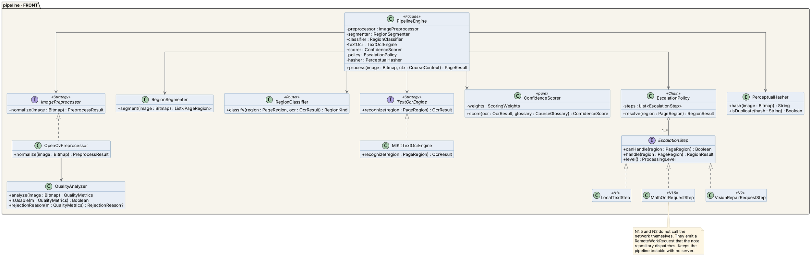
```plantuml
@startuml 05_front_pipeline
skinparam backgroundColor #FFFFFF
skinparam shadowing false
skinparam noteBackgroundColor #FDF6E3
skinparam noteBorderColor #C4BCA3
skinparam linetype ortho
skinparam classAttributeIconSize 0
skinparam defaultFontName Inter
skinparam ArrowColor #63666A
skinparam class {
  BackgroundColor #E8EEF6
  BorderColor #3E6E9E
}
hide empty members

package "pipeline · FRONT" #F7F4EC {

  class PipelineEngine <<Facade>> {
    - preprocessor : ImagePreprocessor
    - segmenter : RegionSegmenter
    - classifier : RegionClassifier
    - textOcr : TextOcrEngine
    - scorer : ConfidenceScorer
    - policy : EscalationPolicy
    - hasher : PerceptualHasher
    + process(image : Bitmap, ctx : CourseContext) : PageResult
  }

  interface ImagePreprocessor <<Strategy>> {
    + normalize(image : Bitmap) : PreprocessResult
  }
  class OpenCvPreprocessor {
    + normalize(image : Bitmap) : PreprocessResult
  }
  class QualityAnalyzer {
    + analyze(image : Bitmap) : QualityMetrics
    + isUsable(m : QualityMetrics) : Boolean
    + rejectionReason(m : QualityMetrics) : RejectionReason?
  }

  class RegionSegmenter {
    + segment(image : Bitmap) : List<PageRegion>
  }
  class RegionClassifier <<Router>> {
    + classify(region : PageRegion, ocr : OcrResult) : RegionKind
  }

  interface TextOcrEngine <<Strategy>> {
    + recognize(region : PageRegion) : OcrResult
  }
  class MlKitTextOcrEngine {
    + recognize(region : PageRegion) : OcrResult
  }

  class ConfidenceScorer <<pure>> {
    - weights : ScoringWeights
    + score(ocr : OcrResult, glossary : CourseGlossary) : ConfidenceScore
  }

  class EscalationPolicy <<Chain>> {
    - steps : List<EscalationStep>
    + resolve(region : PageRegion) : RegionResult
  }
  interface EscalationStep {
    + canHandle(region : PageRegion) : Boolean
    + handle(region : PageRegion) : RegionResult
    + level() : ProcessingLevel
  }
  class LocalTextStep <<N1>>
  class MathOcrRequestStep <<N1.5>>
  class VisionRepairRequestStep <<N2>>

  class PerceptualHasher {
    + hash(image : Bitmap) : String
    + isDuplicate(hash : String) : Boolean
  }
}

PipelineEngine --> ImagePreprocessor
PipelineEngine --> RegionSegmenter
PipelineEngine --> RegionClassifier
PipelineEngine --> TextOcrEngine
PipelineEngine --> ConfidenceScorer
PipelineEngine --> EscalationPolicy
PipelineEngine --> PerceptualHasher

ImagePreprocessor <|.. OpenCvPreprocessor
OpenCvPreprocessor --> QualityAnalyzer
TextOcrEngine <|.. MlKitTextOcrEngine
EscalationPolicy o-- "1..*" EscalationStep
EscalationStep <|.. LocalTextStep
EscalationStep <|.. MathOcrRequestStep
EscalationStep <|.. VisionRepairRequestStep

note bottom of MathOcrRequestStep
  N1.5 and N2 do not call the
  network themselves. They emit a
  RemoteWorkRequest that the note
  repository dispatches. Keeps the
  pipeline testable with no server.
end note
@enduml
```

## 06_front_pipeline_contracts.puml
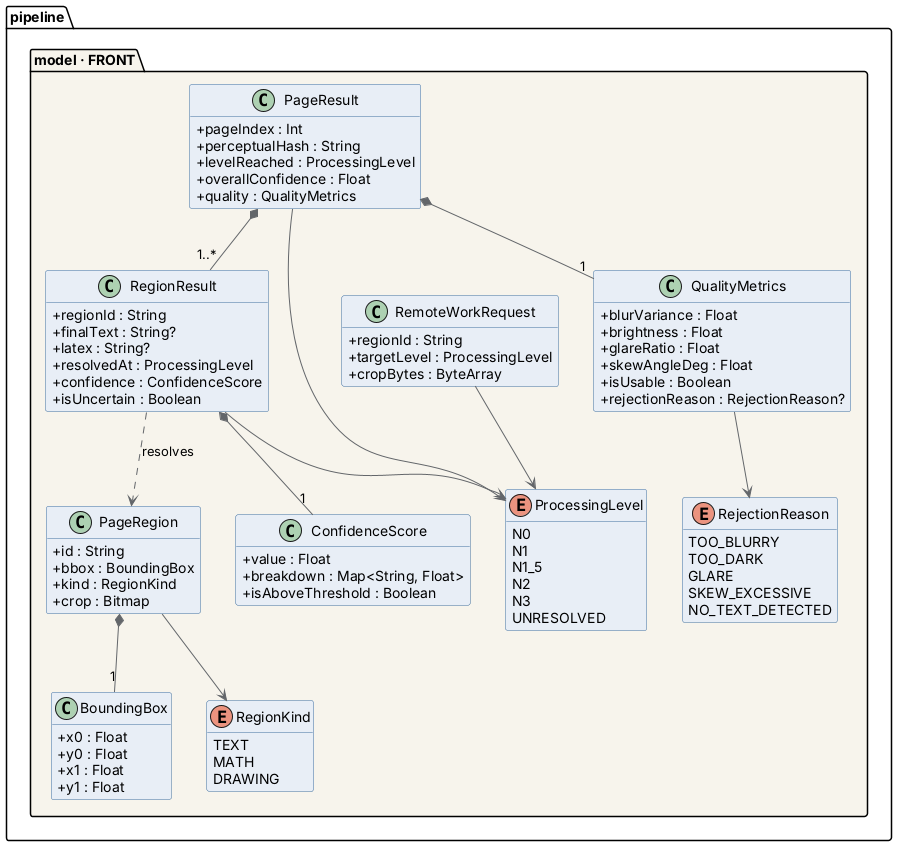
```plantuml
@startuml 06_front_pipeline_contracts
skinparam backgroundColor #FFFFFF
skinparam shadowing false
skinparam noteBackgroundColor #FDF6E3
skinparam noteBorderColor #C4BCA3
skinparam classAttributeIconSize 0
skinparam defaultFontName Inter
skinparam ArrowColor #63666A
skinparam class {
  BackgroundColor #E8EEF6
  BorderColor #3E6E9E
}
skinparam enum {
  BackgroundColor #F7F4EC
  BorderColor #8A6210
}
hide empty methods

package "pipeline.model · FRONT" #F7F4EC {

  class PageResult {
    + pageIndex : Int
    + perceptualHash : String
    + levelReached : ProcessingLevel
    + overallConfidence : Float
    + quality : QualityMetrics
  }

  class PageRegion {
    + id : String
    + bbox : BoundingBox
    + kind : RegionKind
    + crop : Bitmap
  }

  class RegionResult {
    + regionId : String
    + finalText : String?
    + latex : String?
    + resolvedAt : ProcessingLevel
    + confidence : ConfidenceScore
    + isUncertain : Boolean
  }

  class ConfidenceScore {
    + value : Float
    + breakdown : Map<String, Float>
    + isAboveThreshold : Boolean
  }

  class QualityMetrics {
    + blurVariance : Float
    + brightness : Float
    + glareRatio : Float
    + skewAngleDeg : Float
    + isUsable : Boolean
    + rejectionReason : RejectionReason?
  }

  class BoundingBox {
    + x0 : Float
    + y0 : Float
    + x1 : Float
    + y1 : Float
  }

  class RemoteWorkRequest {
    + regionId : String
    + targetLevel : ProcessingLevel
    + cropBytes : ByteArray
  }

  enum ProcessingLevel {
    N0
    N1
    N1_5
    N2
    N3
    UNRESOLVED
  }
  enum RegionKind {
    TEXT
    MATH
    DRAWING
  }
  enum RejectionReason {
    TOO_BLURRY
    TOO_DARK
    GLARE
    SKEW_EXCESSIVE
    NO_TEXT_DETECTED
  }
}

PageResult *-- "1" QualityMetrics
PageResult *-- "1..*" RegionResult
PageResult --> ProcessingLevel
PageRegion *-- "1" BoundingBox
PageRegion --> RegionKind
RegionResult *-- "1" ConfidenceScore
RegionResult --> ProcessingLevel
QualityMetrics --> RejectionReason
RemoteWorkRequest --> ProcessingLevel
RegionResult ..> PageRegion : resolves
@enduml
```

## 07_front_mvvm_slice.puml
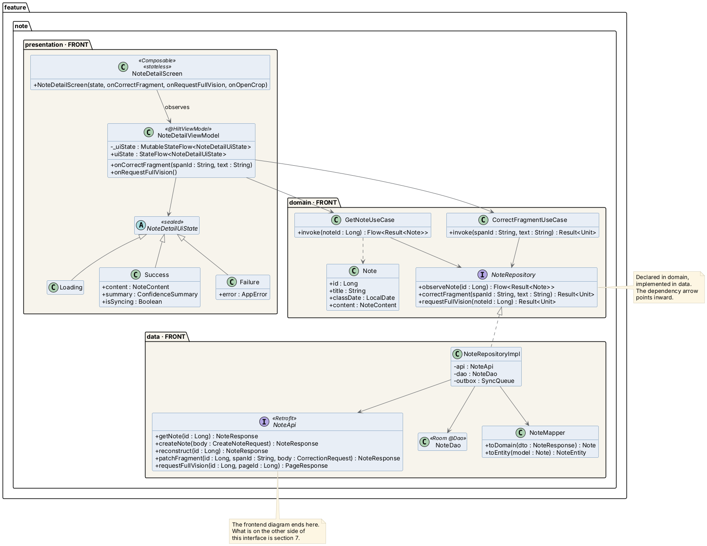
```plantuml
@startuml 07_front_mvvm_slice
skinparam backgroundColor #FFFFFF
skinparam shadowing false
skinparam noteBackgroundColor #FDF6E3
skinparam noteBorderColor #C4BCA3
skinparam classAttributeIconSize 0
skinparam defaultFontName Inter
skinparam ArrowColor #63666A
skinparam class {
  BackgroundColor #E8EEF6
  BorderColor #3E6E9E
}
hide empty members

package "feature.note.presentation · FRONT" #F7F4EC {
  class NoteDetailScreen <<Composable>> <<stateless>> {
    + NoteDetailScreen(state, onCorrectFragment, onRequestFullVision, onOpenCrop)
  }
  class NoteDetailViewModel <<@HiltViewModel>> {
    - _uiState : MutableStateFlow<NoteDetailUiState>
    + uiState : StateFlow<NoteDetailUiState>
    + onCorrectFragment(spanId : String, text : String)
    + onRequestFullVision()
  }
  abstract class NoteDetailUiState <<sealed>>
  class Loading
  class Success {
    + content : NoteContent
    + summary : ConfidenceSummary
    + isSyncing : Boolean
  }
  class Failure {
    + error : AppError
  }
}

package "feature.note.domain · FRONT" #F7F4EC {
  class GetNoteUseCase {
    + invoke(noteId : Long) : Flow<Result<Note>>
  }
  class CorrectFragmentUseCase {
    + invoke(spanId : String, text : String) : Result<Unit>
  }
  interface NoteRepository {
    + observeNote(id : Long) : Flow<Result<Note>>
    + correctFragment(spanId : String, text : String) : Result<Unit>
    + requestFullVision(noteId : Long) : Result<Unit>
  }
  class Note {
    + id : Long
    + title : String
    + classDate : LocalDate
    + content : NoteContent
  }
}

package "feature.note.data · FRONT" #F7F4EC {
  class NoteRepositoryImpl {
    - api : NoteApi
    - dao : NoteDao
    - outbox : SyncQueue
  }
  interface NoteApi <<Retrofit>> {
    + getNote(id : Long) : NoteResponse
    + createNote(body : CreateNoteRequest) : NoteResponse
    + reconstruct(id : Long) : NoteResponse
    + patchFragment(id : Long, spanId : String, body : CorrectionRequest) : NoteResponse
    + requestFullVision(id : Long, pageId : Long) : PageResponse
  }
  class NoteDao <<Room @Dao>>
  class NoteMapper {
    + toDomain(dto : NoteResponse) : Note
    + toEntity(model : Note) : NoteEntity
  }
}

NoteDetailScreen --> NoteDetailViewModel : observes
NoteDetailViewModel --> NoteDetailUiState
NoteDetailUiState <|-- Loading
NoteDetailUiState <|-- Success
NoteDetailUiState <|-- Failure
NoteDetailViewModel --> GetNoteUseCase
NoteDetailViewModel --> CorrectFragmentUseCase
GetNoteUseCase --> NoteRepository
CorrectFragmentUseCase --> NoteRepository
NoteRepository <|.. NoteRepositoryImpl
NoteRepositoryImpl --> NoteApi
NoteRepositoryImpl --> NoteDao
NoteRepositoryImpl --> NoteMapper
GetNoteUseCase ..> Note

note right of NoteRepository
  Declared in domain,
  implemented in data.
  The dependency arrow
  points inward.
end note

note bottom of NoteApi
  The frontend diagram ends here.
  What is on the other side of
  this interface is section 7.
end note
@enduml
```

## 08_front_data_offline.puml

```plantuml
@startuml 08_front_data_offline
skinparam backgroundColor #FFFFFF
skinparam shadowing false
skinparam noteBackgroundColor #FDF6E3
skinparam noteBorderColor #C4BCA3
skinparam linetype ortho
skinparam classAttributeIconSize 0
skinparam defaultFontName Inter
skinparam ArrowColor #63666A
skinparam class {
  BackgroundColor #E8EEF6
  BorderColor #3E6E9E
}
hide empty members

package "core.sync · FRONT" #F7F4EC {
  class SyncQueue {
    - dao : SyncOperationDao
    + enqueue(op : SyncOperation) : Unit
    + nextBatch(limit : Int) : List<SyncOperation>
    + markDone(id : Long) : Unit
    + markFailed(id : Long, error : String) : Unit
  }
  class SyncOperation {
    + id : Long
    + entityType : String
    + idempotencyKey : UUID
    + payload : String
    + attempts : Int
    + status : SyncStatus
    + lastError : String?
  }
  class SyncWorker <<WorkManager>> {
    + doWork() : Result
  }
  class RetryPolicy {
    + delayFor(attempt : Int) : Duration
    + shouldGiveUp(attempt : Int) : Boolean
  }
  class ConnectivityMonitor {
    + isOnline : StateFlow<Boolean>
  }
  enum SyncStatus {
    PENDING
    IN_PROGRESS
    FAILED
    DONE
  }
}

package "core.database · FRONT" #F7F4EC {
  class GlifoDatabase <<Room @Database>> {
    + noteDao() : NoteDao
    + pageDao() : PageDao
    + studyItemDao() : StudyItemDao
    + coverageDao() : CoverageDao
    + syncOperationDao() : SyncOperationDao
    + courseContextDao() : LocalCourseContextDao
  }
  interface SyncOperationDao <<@Dao>>
  interface NoteDao <<@Dao>>
  interface LocalCourseContextDao <<@Dao>> {
    + upsert(ctx : LocalCourseContextEntity) : Unit
    + forCourse(courseId : Long) : LocalCourseContextEntity?
    + versions(courseId : Long) : ContextVersions?
  }
  class LocalCourseContextEntity <<Room @Entity>> {
    + courseId : Long
    + courseName : String
    + syllabusVersion : Int
    + glossaryVersion : Int
    + glossaryEntries : String
    + cachedAt : Instant
  }
  class Converters <<@TypeConverter>> {
    + jsonToContent(raw : String) : NoteContent
    + contentToJson(c : NoteContent) : String
  }
}

package "pipeline · FRONT" #F7F4EC {
  class LocalCourseContext <<domain>> {
    + courseId : Long
    + courseName : String
    + syllabusVersion : Int
    + glossaryVersion : Int
    + glossaryEntries : List<GlossaryEntry>
  }
  class PipelineEngine <<Facade>>
  class ConfidenceScorer <<pure>>
}

package "core.network · FRONT" #F7F4EC {
  class ApiClient <<Retrofit>>
  class AuthInterceptor <<OkHttp>> {
    + intercept(chain) : Response
  }
  class ErrorMapper {
    + map(code : Int, body : String?) : AppError
  }
}

SyncQueue --> SyncOperationDao
SyncQueue ..> SyncOperation
SyncOperation --> SyncStatus
SyncWorker --> SyncQueue
SyncWorker --> RetryPolicy
SyncWorker --> ApiClient
SyncWorker --> ConnectivityMonitor
GlifoDatabase --> SyncOperationDao
GlifoDatabase --> NoteDao
GlifoDatabase --> LocalCourseContextDao
GlifoDatabase --> Converters
LocalCourseContextDao --> LocalCourseContextEntity
LocalCourseContextEntity ..> LocalCourseContext : mapper
PipelineEngine --> LocalCourseContext
PipelineEngine --> ConfidenceScorer
ConfidenceScorer ..> LocalCourseContext : reads glossary
SyncWorker ..> LocalCourseContextDao : refreshes on reconnect
ApiClient --> AuthInterceptor
ApiClient --> ErrorMapper

note bottom of LocalCourseContext
  D-17. Without this, the pipeline
  cannot run offline: ConfidenceScorer
  needs the course glossary to score a
  region. glossaryVersion is what makes
  the cache invalidatable on reconnect.
end note

note bottom of RetryPolicy
  Exponential backoff with jitter.
  idempotencyKey is generated once,
  at enqueue time — never per attempt.
  That single choice is what makes
  a retry safe.
end note
@enduml
```

## 09_back_domain.puml
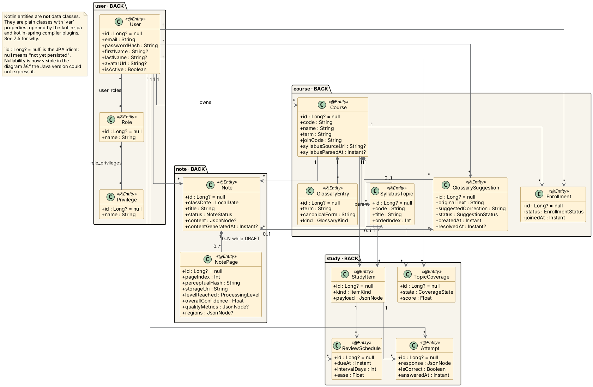
```plantuml
@startuml 09_back_domain
skinparam backgroundColor #FFFFFF
skinparam shadowing false
skinparam noteBackgroundColor #FDF6E3
skinparam noteBorderColor #C4BCA3
skinparam linetype ortho
skinparam classAttributeIconSize 0
skinparam defaultFontName Inter
skinparam ArrowColor #63666A
skinparam class {
  BackgroundColor #FFF3D8
  BorderColor #8A6210
}
hide empty methods

package "user · BACK" #F7F4EC {
  class User <<@Entity>> {
    + id : Long? = null
    + email : String
    + passwordHash : String
    + firstName : String?
    + lastName : String?
    + avatarUrl : String?
    + isActive : Boolean
  }
  class Role <<@Entity>> {
    + id : Long? = null
    + name : String
  }
  class Privilege <<@Entity>> {
    + id : Long? = null
    + name : String
  }
}

package "course · BACK" #F7F4EC {
  class Course <<@Entity>> {
    + id : Long? = null
    + code : String
    + name : String
    + term : String
    + joinCode : String
    + syllabusSourceUri : String?
    + syllabusParsedAt : Instant?
  }
  class Enrollment <<@Entity>> {
    + id : Long? = null
    + status : EnrollmentStatus
    + joinedAt : Instant
  }
  class SyllabusTopic <<@Entity>> {
    + id : Long? = null
    + code : String
    + title : String
    + orderIndex : Int
  }
  class GlossaryEntry <<@Entity>> {
    + id : Long? = null
    + term : String
    + canonicalForm : String
    + kind : GlossaryKind
  }
  class GlossarySuggestion <<@Entity>> {
    + id : Long? = null
    + originalText : String
    + suggestedCorrection : String
    + status : SuggestionStatus
    + createdAt : Instant
    + resolvedAt : Instant?
  }
}

package "note · BACK" #F7F4EC {
  class Note <<@Entity>> {
    + id : Long? = null
    + classDate : LocalDate
    + title : String
    + status : NoteStatus
    + content : JsonNode?
    + contentGeneratedAt : Instant?
  }
  class NotePage <<@Entity>> {
    + id : Long? = null
    + pageIndex : Int
    + perceptualHash : String
    + storageUri : String
    + levelReached : ProcessingLevel
    + overallConfidence : Float
    + qualityMetrics : JsonNode?
    + regions : JsonNode?
  }
}

package "study · BACK" #F7F4EC {
  class TopicCoverage <<@Entity>> {
    + id : Long? = null
    + state : CoverageState
    + score : Float
  }
  class StudyItem <<@Entity>> {
    + id : Long? = null
    + kind : ItemKind
    + payload : JsonNode
  }
  class Attempt <<@Entity>> {
    + id : Long? = null
    + response : JsonNode
    + isCorrect : Boolean
    + answeredAt : Instant
  }
  class ReviewSchedule <<@Entity>> {
    + id : Long? = null
    + dueAt : Instant
    + intervalDays : Int
    + ease : Float
  }
}

User "*" -- "*" Role : user_roles
Role "*" -- "*" Privilege : role_privileges

User "1" --> "*" Course : owns
User "1" --> "*" Enrollment
Course "1" --> "*" Enrollment
Course "1" *-- "*" SyllabusTopic
Course "1" *-- "*" GlossaryEntry
Course "1" *-- "*" GlossarySuggestion
User "1" --> "*" GlossarySuggestion
SyllabusTopic "0..1" --> "*" SyllabusTopic : parent

User "1" --> "*" Note
Course "1" --> "*" Note
SyllabusTopic "0..1" --> "*" Note
Note "1" *-- "0..*" NotePage : "0..N while DRAFT"
Note "0..1" --> "*" GlossarySuggestion

User "1" --> "*" TopicCoverage
SyllabusTopic "1" --> "*" TopicCoverage
Course "1" --> "*" StudyItem
SyllabusTopic "1" --> "*" StudyItem
User "1" --> "*" Attempt
StudyItem "1" --> "*" Attempt
User "1" --> "*" ReviewSchedule
StudyItem "1" --> "*" ReviewSchedule

note as N1
  Kotlin entities are **not** data classes.
  They are plain classes with `var`
  properties, opened by the kotlin-jpa
  and kotlin-spring compiler plugins.
  See 7.5 for why.

  `id : Long? = null` is the JPA idiom:
  null means "not yet persisted".
  Nullability is now visible in the
  diagram — the Java version could
  not express it.
end note
@enduml
```

## 10_back_web_service_slice.puml
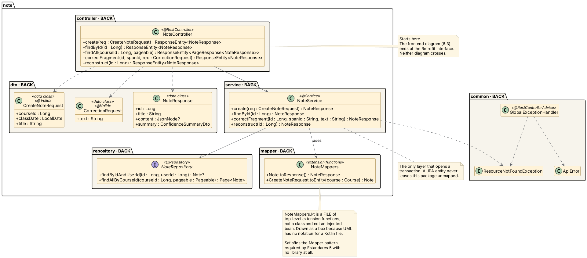
```plantuml
@startuml 10_back_web_service_slice
skinparam backgroundColor #FFFFFF
skinparam shadowing false
skinparam noteBackgroundColor #FDF6E3
skinparam noteBorderColor #C4BCA3
skinparam classAttributeIconSize 0
skinparam defaultFontName Inter
skinparam ArrowColor #63666A
skinparam class {
  BackgroundColor #FFF3D8
  BorderColor #8A6210
}
hide empty members

package "note.controller · BACK" #F7F4EC {
  class NoteController <<@RestController>> {
    + create(req : CreateNoteRequest) : ResponseEntity<NoteResponse>
    + findById(id : Long) : ResponseEntity<NoteResponse>
    + findAll(courseId : Long, pageable) : ResponseEntity<PageResponse<NoteResponse>>
    + correctFragment(id, spanId, req : CorrectionRequest) : ResponseEntity<NoteResponse>
    + reconstruct(id : Long) : ResponseEntity<NoteResponse>
  }
}

package "note.dto · BACK" #F7F4EC {
  class CreateNoteRequest <<data class>> <<@Valid>> {
    + courseId : Long
    + classDate : LocalDate
    + title : String
  }
  class CorrectionRequest <<data class>> <<@Valid>> {
    + text : String
  }
  class NoteResponse <<data class>> {
    + id : Long
    + title : String
    + content : JsonNode?
    + summary : ConfidenceSummaryDto
  }
}

package "note.service · BACK" #F7F4EC {
  class NoteService <<@Service>> {
    + create(req : CreateNoteRequest) : NoteResponse
    + findById(id : Long) : NoteResponse
    + correctFragment(id : Long, spanId : String, text : String) : NoteResponse
    + reconstruct(id : Long) : NoteResponse
  }
}

package "note.repository · BACK" #F7F4EC {
  interface NoteRepository <<@Repository>> {
    + findByIdAndUserId(id : Long, userId : Long) : Note?
    + findAllByCourseId(courseId : Long, pageable : Pageable) : Page<Note>
  }
}

package "note.mapper · BACK" #F7F4EC {
  class NoteMappers <<extension functions>> {
    + Note.toResponse() : NoteResponse
    + CreateNoteRequest.toEntity(course : Course) : Note
  }
}

package "common · BACK" #F7F4EC {
  class GlobalExceptionHandler <<@RestControllerAdvice>>
  class ApiError
  class ResourceNotFoundException
}

NoteController --> NoteService
NoteController ..> CreateNoteRequest
NoteController ..> CorrectionRequest
NoteController ..> NoteResponse
NoteService --> NoteRepository
NoteService ..> NoteMappers : uses
NoteService ..> ResourceNotFoundException
GlobalExceptionHandler ..> ApiError
GlobalExceptionHandler ..> ResourceNotFoundException

note right of NoteController
  Starts here.
  The frontend diagram (6.3)
  ends at the Retrofit interface.
  Neither diagram crosses.
end note

note bottom of NoteService
  The only layer that opens a
  transaction. A JPA entity never
  leaves this package unmapped.
end note

note bottom of NoteMappers
  NoteMappers.kt is a FILE of
  top-level extension functions,
  not a class and not an injected
  bean. Drawn as a box because UML
  has no notation for a Kotlin file.

  Satisfies the Mapper pattern
  required by Estandares 5 with
  no library at all.
end note
@enduml
```

## 11_back_ai_orchestration.puml
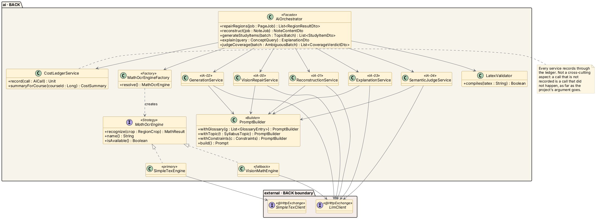
```plantuml
@startuml 11_back_ai_orchestration
skinparam backgroundColor #FFFFFF
skinparam shadowing false
skinparam noteBackgroundColor #FDF6E3
skinparam noteBorderColor #C4BCA3
skinparam classAttributeIconSize 0
skinparam defaultFontName Inter
skinparam ArrowColor #63666A
skinparam class {
  BackgroundColor #FFF3D8
  BorderColor #8A6210
}
hide empty fields

package "ai · BACK" #F7F4EC {

  class AiOrchestrator <<Facade>> {
    + repairRegions(job : PageJob) : List<RegionResultDto>
    + reconstruct(job : NoteJob) : NoteContentDto
    + generateStudyItems(batch : TopicBatch) : List<StudyItemDto>
    + explain(query : ConceptQuery) : ExplanationDto
    + judgeCoverage(batch : AmbiguousBatch) : List<CoverageVerdictDto>
  }

  interface MathOcrEngine <<Strategy>> {
    + recognize(crop : RegionCrop) : MathResult
    + name() : String
    + isAvailable() : Boolean
  }
  class SimpleTexEngine <<primary>>
  class VisionMathEngine <<fallback>>
  class MathOcrEngineFactory <<Factory>> {
    + resolve() : MathOcrEngine
  }

  class VisionRepairService <<IA-00>>
  class ReconstructionService <<IA-01>>
  class GenerationService <<IA-02>>
  class ExplanationService <<IA-03>>
  class SemanticJudgeService <<IA-04>>

  class PromptBuilder <<Builder>> {
    + withGlossary(g : List<GlossaryEntry>) : PromptBuilder
    + withTopic(t : SyllabusTopic) : PromptBuilder
    + withConstraints(c : Constraints) : PromptBuilder
    + build() : Prompt
  }
  class LatexValidator {
    + compiles(latex : String) : Boolean
  }
  class CostLedgerService {
    + record(call : AiCall) : Unit
    + summaryForCourse(courseId : Long) : CostSummary
  }
}

package "external · BACK boundary" #F5EDE9 {
  interface SimpleTexClient <<@HttpExchange>>
  interface LlmClient <<@HttpExchange>>
}

AiOrchestrator --> MathOcrEngineFactory
AiOrchestrator --> VisionRepairService
AiOrchestrator --> ReconstructionService
AiOrchestrator --> GenerationService
AiOrchestrator --> ExplanationService
AiOrchestrator --> SemanticJudgeService
AiOrchestrator --> CostLedgerService
AiOrchestrator --> LatexValidator

MathOcrEngineFactory ..> MathOcrEngine : creates
MathOcrEngine <|.. SimpleTexEngine
MathOcrEngine <|.. VisionMathEngine
SimpleTexEngine --> SimpleTexClient
VisionMathEngine --> LlmClient

VisionRepairService --> LlmClient
ReconstructionService --> LlmClient
GenerationService --> LlmClient
ExplanationService --> LlmClient
SemanticJudgeService --> LlmClient

VisionRepairService --> PromptBuilder
ReconstructionService --> PromptBuilder
GenerationService --> PromptBuilder
ExplanationService --> PromptBuilder
SemanticJudgeService --> PromptBuilder

note right of CostLedgerService
  Every service records through
  the ledger. Not a cross-cutting
  aspect: a call that is not
  recorded is a call that did
  not happen, as far as the
  project's argument goes.
end note
@enduml
```

## 12_back_security.puml
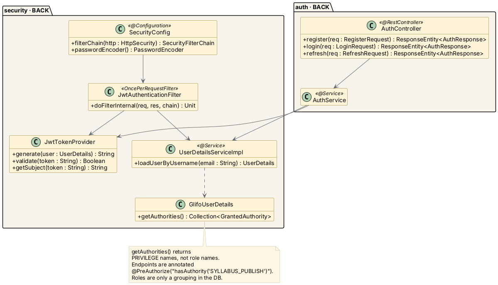
```plantuml
@startuml 12_back_security
skinparam backgroundColor #FFFFFF
skinparam shadowing false
skinparam noteBackgroundColor #FDF6E3
skinparam noteBorderColor #C4BCA3
skinparam classAttributeIconSize 0
skinparam defaultFontName Inter
skinparam ArrowColor #63666A
skinparam class {
  BackgroundColor #FFF3D8
  BorderColor #8A6210
}
hide empty members

package "security · BACK" #F7F4EC {
  class SecurityConfig <<@Configuration>> {
    + filterChain(http : HttpSecurity) : SecurityFilterChain
    + passwordEncoder() : PasswordEncoder
  }
  class JwtAuthenticationFilter <<OncePerRequestFilter>> {
    + doFilterInternal(req, res, chain) : Unit
  }
  class JwtTokenProvider {
    + generate(user : UserDetails) : String
    + validate(token : String) : Boolean
    + getSubject(token : String) : String
  }
  class UserDetailsServiceImpl <<@Service>> {
    + loadUserByUsername(email : String) : UserDetails
  }
  class GlifoUserDetails {
    + getAuthorities() : Collection<GrantedAuthority>
  }
}

package "auth · BACK" #F7F4EC {
  class AuthController <<@RestController>> {
    + register(req : RegisterRequest) : ResponseEntity<AuthResponse>
    + login(req : LoginRequest) : ResponseEntity<AuthResponse>
    + refresh(req : RefreshRequest) : ResponseEntity<AuthResponse>
  }
  class AuthService <<@Service>>
}

SecurityConfig --> JwtAuthenticationFilter
JwtAuthenticationFilter --> JwtTokenProvider
JwtAuthenticationFilter --> UserDetailsServiceImpl
UserDetailsServiceImpl ..> GlifoUserDetails
AuthController --> AuthService
AuthService --> JwtTokenProvider
AuthService --> UserDetailsServiceImpl

note bottom of GlifoUserDetails
  getAuthorities() returns
  PRIVILEGE names, not role names.
  Endpoints are annotated
  @PreAuthorize("hasAuthority('SYLLABUS_PUBLISH')").
  Roles are only a grouping in the DB.
end note
@enduml
```

## 13_component_api_seam.puml
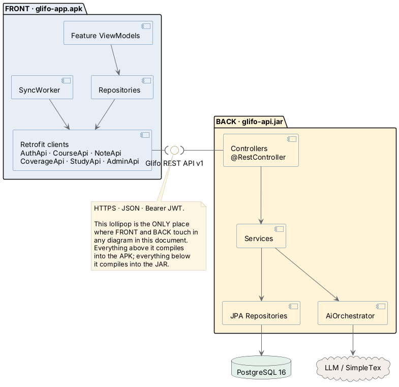
```plantuml
@startuml 13_component_api_seam
skinparam backgroundColor #FFFFFF
skinparam shadowing false
skinparam noteBackgroundColor #FDF6E3
skinparam noteBorderColor #C4BCA3
skinparam defaultFontName Inter
skinparam ArrowColor #63666A
skinparam component {
  BackgroundColor #E8EEF6
  BorderColor #3E6E9E
}
skinparam interface {
  BackgroundColor #FFFFFF
  BorderColor #8A6210
}

package "FRONT · glifo-app.apk" #E8EEF6 {
  component "Feature ViewModels" as vms
  component "Repositories" as repos
  component "Retrofit clients\nAuthApi · CourseApi · NoteApi\nCoverageApi · StudyApi · AdminApi" as clients
  component "SyncWorker" as sync
}

package "BACK · glifo-api.jar" #FFF3D8 {
  component "Controllers\n@RestController" as ctrls #FFF3D8
  component "Services" as svcs #FFF3D8
  component "JPA Repositories" as jpa #FFF3D8
  component "AiOrchestrator" as ai #FFF3D8
}

interface "Glifo REST API v1" as API

vms --> repos
repos --> clients
sync --> clients
clients -( API
API )- ctrls
ctrls --> svcs
svcs --> jpa
svcs --> ai

database "PostgreSQL 16" as pg #E4F0EA
jpa --> pg

cloud "LLM / SimpleTex" as ext #F5EDE9
ai --> ext

note bottom of API
  HTTPS · JSON · Bearer JWT.

  This lollipop is the ONLY place
  where FRONT and BACK touch in
  any diagram in this document.
  Everything above it compiles
  into the APK; everything below
  it compiles into the JAR.
end note
@enduml
```

## 14_seq_capture_to_note.puml
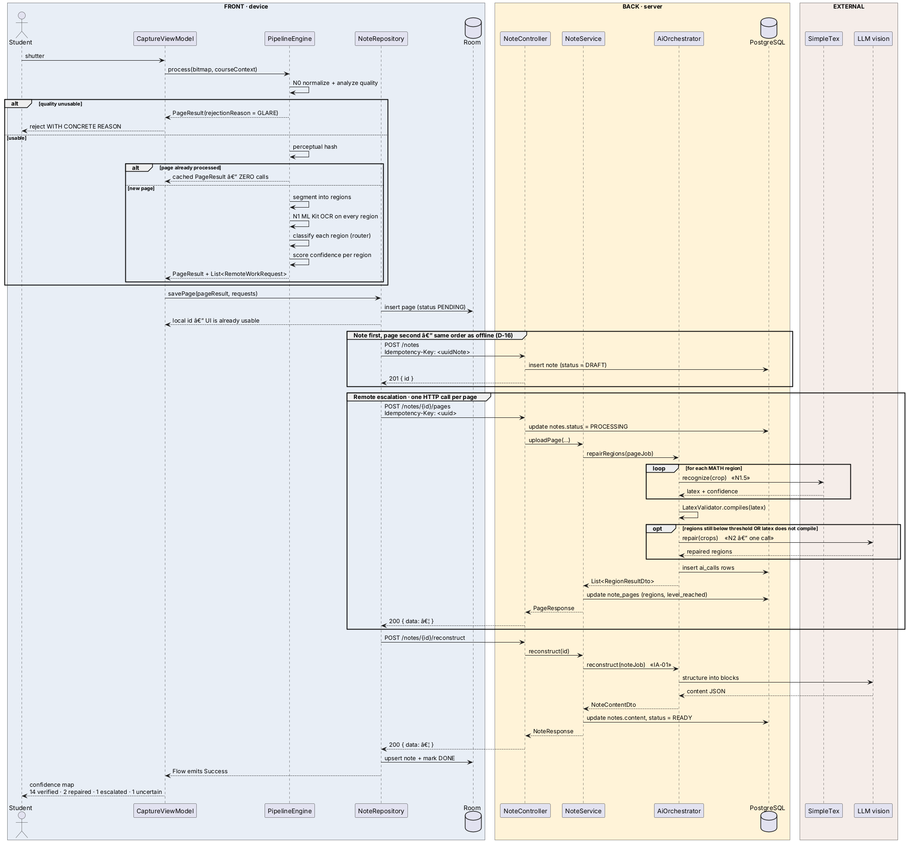
```plantuml
@startuml 14_seq_capture_to_note
skinparam backgroundColor #FFFFFF
skinparam shadowing false
skinparam noteBackgroundColor #FDF6E3
skinparam noteBorderColor #C4BCA3
skinparam defaultFontName Inter
skinparam sequenceMessageAlign left
skinparam ParticipantPadding 8
skinparam BoxPadding 10

box "FRONT · device" #E8EEF6
  actor Student as S
  participant "CaptureViewModel" as VM
  participant "PipelineEngine" as PE
  participant "NoteRepository" as NR
  database "Room" as RM
end box

box "BACK · server" #FFF3D8
  participant "NoteController" as NC
  participant "NoteService" as NS
  participant "AiOrchestrator" as AI
  database "PostgreSQL" as PG
end box

box "EXTERNAL" #F5EDE9
  participant "SimpleTex" as ST
  participant "LLM vision" as LLM
end box

S -> VM : shutter
VM -> PE : process(bitmap, courseContext)

PE -> PE : N0 normalize + analyze quality
alt quality unusable
  PE --> VM : PageResult(rejectionReason = GLARE)
  VM --> S : reject WITH CONCRETE REASON
else usable
  PE -> PE : perceptual hash
  alt page already processed
    PE --> VM : cached PageResult — ZERO calls
  else new page
    PE -> PE : segment into regions
    PE -> PE : N1 ML Kit OCR on every region
    PE -> PE : classify each region (router)
    PE -> PE : score confidence per region
    PE --> VM : PageResult + List<RemoteWorkRequest>
  end
end

VM -> NR : savePage(pageResult, requests)
NR -> RM : insert page (status PENDING)
NR --> VM : local id — UI is already usable

group Note first, page second — same order as offline (D-16)
  NR -> NC : POST /notes\nIdempotency-Key: <uuidNote>
  NC -> PG : insert note (status = DRAFT)
  NC --> NR : 201 { id }
end

group Remote escalation · one HTTP call per page
  NR -> NC : POST /notes/{id}/pages\nIdempotency-Key: <uuid>
  NC -> PG : update notes.status = PROCESSING
  NC -> NS : uploadPage(...)
  NS -> AI : repairRegions(pageJob)

  loop for each MATH region
    AI -> ST : recognize(crop)   <<N1.5>>
    ST --> AI : latex + confidence
  end
  AI -> AI : LatexValidator.compiles(latex)

  opt regions still below threshold OR latex does not compile
    AI -> LLM : repair(crops)    <<N2 — one call>>
    LLM --> AI : repaired regions
  end

  AI -> PG : insert ai_calls rows
  AI --> NS : List<RegionResultDto>
  NS -> PG : update note_pages (regions, level_reached)
  NS --> NC : PageResponse
  NC --> NR : 200 { data: … }
end

NR -> NC : POST /notes/{id}/reconstruct
NC -> NS : reconstruct(id)
NS -> AI : reconstruct(noteJob)   <<IA-01>>
AI -> LLM : structure into blocks
LLM --> AI : content JSON
AI --> NS : NoteContentDto
NS -> PG : update notes.content, status = READY
NS --> NC : NoteResponse
NC --> NR : 200 { data: … }

NR -> RM : upsert note + mark DONE
NR --> VM : Flow emits Success
VM --> S : confidence map\n14 verified · 2 repaired · 1 escalated · 1 uncertain
@enduml
```

## 15_seq_offline_sync.puml
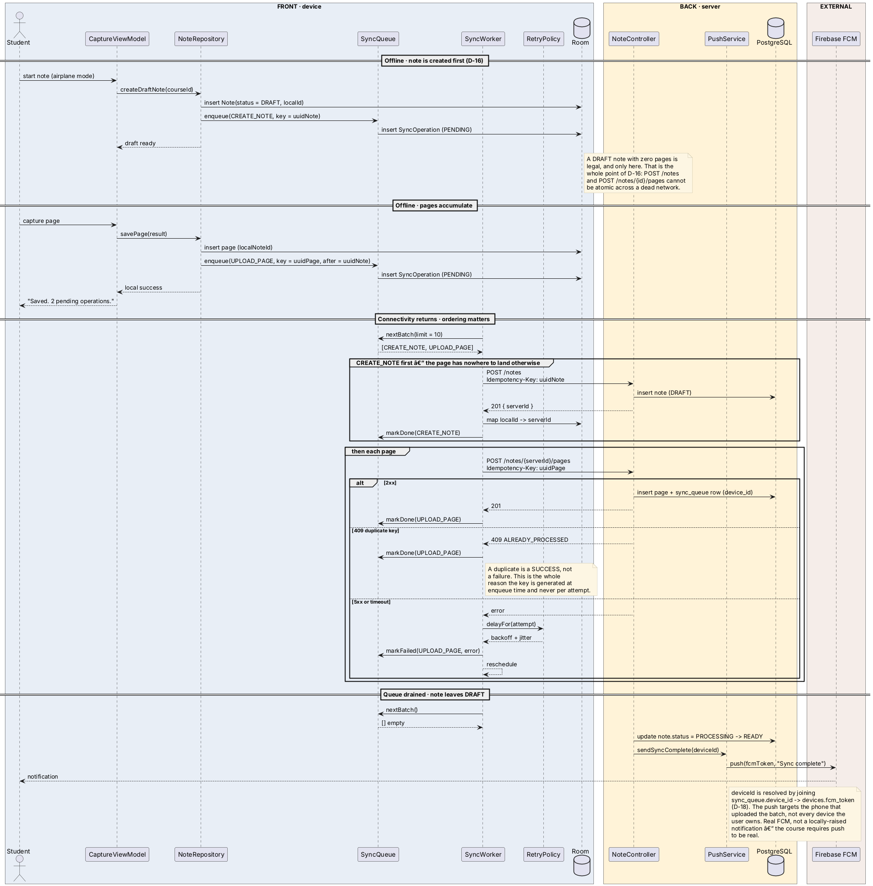
```plantuml
@startuml 15_seq_offline_sync
skinparam backgroundColor #FFFFFF
skinparam shadowing false
skinparam noteBackgroundColor #FDF6E3
skinparam noteBorderColor #C4BCA3
skinparam defaultFontName Inter
skinparam sequenceMessageAlign left
skinparam ParticipantPadding 8
skinparam BoxPadding 10

box "FRONT · device" #E8EEF6
  actor Student as S
  participant "CaptureViewModel" as VM
  participant "NoteRepository" as NR
  participant "SyncQueue" as SQ
  participant "SyncWorker" as SW
  participant "RetryPolicy" as RP
  database "Room" as RM
end box

box "BACK · server" #FFF3D8
  participant "NoteController" as NC
  participant "PushService" as PS
  database "PostgreSQL" as PG
end box

box "EXTERNAL" #F5EDE9
  participant "Firebase FCM" as FCM
end box

== Offline · note is created first (D-16) ==
S -> VM : start note (airplane mode)
VM -> NR : createDraftNote(courseId)
NR -> RM : insert Note(status = DRAFT, localId)
NR -> SQ : enqueue(CREATE_NOTE, key = uuidNote)
SQ -> RM : insert SyncOperation (PENDING)
NR --> VM : draft ready
note right of RM
  A DRAFT note with zero pages is
  legal, and only here. That is the
  whole point of D-16: POST /notes
  and POST /notes/{id}/pages cannot
  be atomic across a dead network.
end note

== Offline · pages accumulate ==
S -> VM : capture page
VM -> NR : savePage(result)
NR -> RM : insert page (localNoteId)
NR -> SQ : enqueue(UPLOAD_PAGE, key = uuidPage, after = uuidNote)
SQ -> RM : insert SyncOperation (PENDING)
NR --> VM : local success
VM --> S : "Saved. 2 pending operations."

== Connectivity returns · ordering matters ==
SW -> SQ : nextBatch(limit = 10)
SQ --> SW : [CREATE_NOTE, UPLOAD_PAGE]

group CREATE_NOTE first — the page has nowhere to land otherwise
  SW -> NC : POST /notes\nIdempotency-Key: uuidNote
  NC -> PG : insert note (DRAFT)
  NC --> SW : 201 { serverId }
  SW -> RM : map localId -> serverId
  SW -> SQ : markDone(CREATE_NOTE)
end

group then each page
  SW -> NC : POST /notes/{serverId}/pages\nIdempotency-Key: uuidPage
  alt 2xx
    NC -> PG : insert page + sync_queue row (device_id)
    NC --> SW : 201
    SW -> SQ : markDone(UPLOAD_PAGE)
  else 409 duplicate key
    NC --> SW : 409 ALREADY_PROCESSED
    SW -> SQ : markDone(UPLOAD_PAGE)
    note right of SW
      A duplicate is a SUCCESS, not
      a failure. This is the whole
      reason the key is generated at
      enqueue time and never per attempt.
    end note
  else 5xx or timeout
    NC --> SW : error
    SW -> RP : delayFor(attempt)
    RP --> SW : backoff + jitter
    SW -> SQ : markFailed(UPLOAD_PAGE, error)
    SW --> SW : reschedule
  end
end

== Queue drained · note leaves DRAFT ==
SW -> SQ : nextBatch()
SQ --> SW : [] empty
NC -> PG : update note.status = PROCESSING -> READY
NC -> PS : sendSyncComplete(deviceId)
PS -> FCM : push(fcmToken, "Sync complete")
FCM --> S : notification

note right of PS
  deviceId is resolved by joining
  sync_queue.device_id -> devices.fcm_token
  (D-18). The push targets the phone that
  uploaded the batch, not every device the
  user owns. Real FCM, not a locally-raised
  notification — the course requires push
  to be real.
end note
@enduml
```

## 16_nav_toplevel.puml
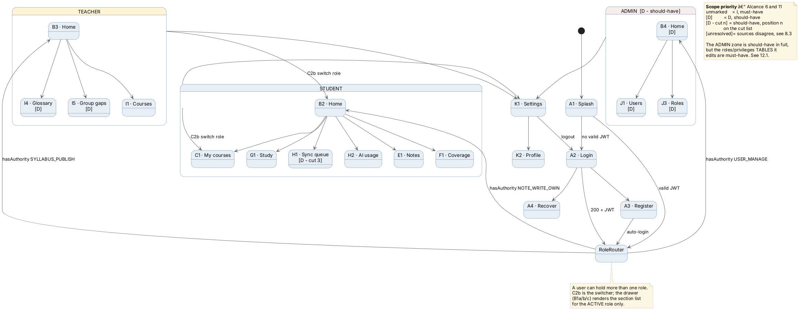
```plantuml
@startuml 16_nav_toplevel
skinparam backgroundColor #FFFFFF
skinparam shadowing false
skinparam noteBackgroundColor #FDF6E3
skinparam noteBorderColor #C4BCA3
skinparam defaultFontName Inter
skinparam ArrowColor #63666A
skinparam state {
  BackgroundColor #E8EEF6
  BorderColor #3E6E9E
  FontName Inter
}

[*] --> A1
state "A1 · Splash" as A1
state "A2 · Login" as A2
state "A3 · Register" as A3
state "A4 · Recover" as A4

A1 --> A2 : no valid JWT
A1 --> RoleRouter : valid JWT
A2 --> A3
A2 --> A4
A3 --> RoleRouter : auto-login
A2 --> RoleRouter : 200 + JWT

state RoleRouter <<choice>>

state "STUDENT" as Student #E8EEF6 {
  state "B2 · Home" as B2
  state "C1 · My courses" as C1
  state "E1 · Notes" as E1
  state "F1 · Coverage" as F1
  state "G1 · Study" as G1
  state "H1 · Sync queue\n[D - cut 3]" as H1
  state "H2 · AI usage" as H2
  B2 --> C1
  B2 --> E1
  B2 --> F1
  B2 --> G1
  B2 --> H1
  B2 --> H2
}

state "TEACHER" as Teacher #FFF3D8 {
  state "B3 · Home" as B3
  state "I1 · Courses" as I1
  state "I4 · Glossary\n[D]" as I4
  state "I5 · Group gaps\n[D]" as I5
  B3 --> I1
  B3 --> I4
  B3 --> I5
}

state "ADMIN  [D - should-have]" as Admin #F5EDE9 {
  state "B4 · Home\n[D]" as B4
  state "J1 · Users\n[D]" as J1
  state "J3 · Roles\n[D]" as J3
  B4 --> J1
  B4 --> J3
}

state "K1 · Settings" as K1
state "K2 · Profile" as K2

RoleRouter --> B2 : hasAuthority NOTE_WRITE_OWN
RoleRouter --> B3 : hasAuthority SYLLABUS_PUBLISH
RoleRouter --> B4 : hasAuthority USER_MANAGE

Student --> K1
Teacher --> K1
Admin  --> K1
K1 --> K2
K1 --> A2 : logout

Student --> C1 : C2b switch role
Teacher --> B2 : C2b switch role

note bottom of RoleRouter
  A user can hold more than one role.
  C2b is the switcher; the drawer
  (B1a/b/c) renders the section list
  for the ACTIVE role only.
end note

note as Legend
  **Scope priority** — Alcance 6 and 11
  unmarked    = I, must-have
  [D]         = D, should-have
  [D - cut n] = should-have, position n
                on the cut list
  [unresolved]= sources disagree, see 8.3

  The ADMIN zone is should-have in full,
  but the roles/privileges TABLES it
  edits are must-have. See 12.1.
end note
@enduml
```

## 17_nav_capture_flow.puml
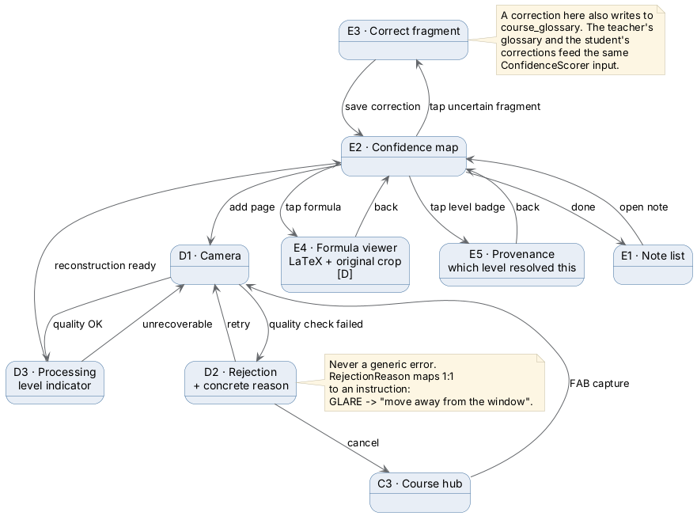
```plantuml
@startuml 17_nav_capture_flow
skinparam backgroundColor #FFFFFF
skinparam shadowing false
skinparam noteBackgroundColor #FDF6E3
skinparam noteBorderColor #C4BCA3
skinparam defaultFontName Inter
skinparam ArrowColor #63666A
skinparam state {
  BackgroundColor #E8EEF6
  BorderColor #3E6E9E
  FontName Inter
}

state "C3 · Course hub" as C3
state "D1 · Camera" as D1
state "D2 · Rejection\n+ concrete reason" as D2
state "D3 · Processing\nlevel indicator" as D3
state "E2 · Confidence map" as E2
state "E3 · Correct fragment" as E3
state "E4 · Formula viewer\nLaTeX + original crop\n[D]" as E4
state "E5 · Provenance\nwhich level resolved this" as E5
state "E1 · Note list" as E1

C3 --> D1 : FAB capture
D1 --> D2 : quality check failed
D2 --> D1 : retry
D2 --> C3 : cancel
D1 --> D3 : quality OK
D3 --> E2 : reconstruction ready
D3 --> D1 : unrecoverable
E2 --> E3 : tap uncertain fragment
E3 --> E2 : save correction
E2 --> E4 : tap formula
E4 --> E2 : back
E2 --> E5 : tap level badge
E5 --> E2 : back
E2 --> D1 : add page
E2 --> E1 : done
E1 --> E2 : open note

note right of E3
  A correction here also writes to
  course_glossary. The teacher's
  glossary and the student's
  corrections feed the same
  ConfidenceScorer input.
end note

note right of D2
  Never a generic error.
  RejectionReason maps 1:1
  to an instruction:
  GLARE -> "move away from the window".
end note
@enduml
```

## 18_nav_study_flow.puml
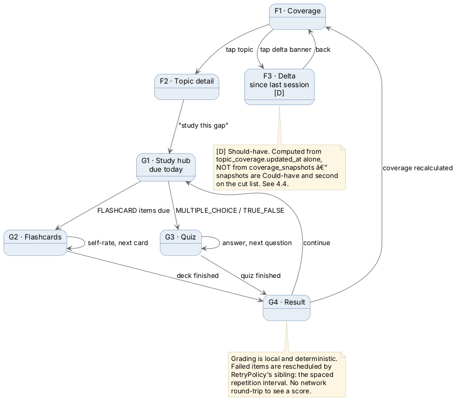
```plantuml
@startuml 18_nav_study_flow
skinparam backgroundColor #FFFFFF
skinparam shadowing false
skinparam noteBackgroundColor #FDF6E3
skinparam noteBorderColor #C4BCA3
skinparam defaultFontName Inter
skinparam ArrowColor #63666A
skinparam state {
  BackgroundColor #E8EEF6
  BorderColor #3E6E9E
  FontName Inter
}

state "F1 · Coverage" as F1
state "F2 · Topic detail" as F2
state "F3 · Delta\nsince last session\n[D]" as F3
state "G1 · Study hub\ndue today" as G1
state "G2 · Flashcards" as G2
state "G3 · Quiz" as G3
state "G4 · Result" as G4

F1 --> F2 : tap topic
F1 --> F3 : tap delta banner
F2 --> G1 : "study this gap"
F3 --> F1 : back
G1 --> G2 : FLASHCARD items due
G1 --> G3 : MULTIPLE_CHOICE / TRUE_FALSE
G2 --> G2 : self-rate, next card
G2 --> G4 : deck finished
G3 --> G3 : answer, next question
G3 --> G4 : quiz finished
G4 --> G1 : continue
G4 --> F1 : coverage recalculated

note bottom of G4
  Grading is local and deterministic.
  Failed items are rescheduled by
  RetryPolicy's sibling: the spaced
  repetition interval. No network
  round-trip to see a score.
end note

note bottom of F3
  [D] Should-have. Computed from
  topic_coverage.updated_at alone,
  NOT from coverage_snapshots —
  snapshots are Could-have and second
  on the cut list. See 4.4.
end note
@enduml
```

